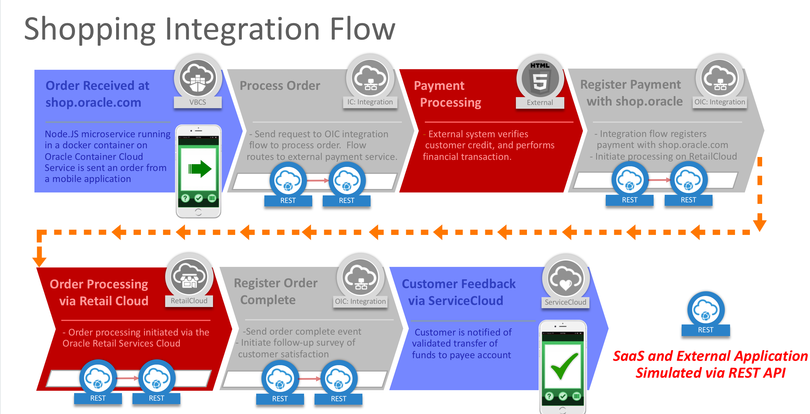

# **Oracle Integration Cloud (OIC) Developer Workshop**

> Updated: February, 2019

## **Upgrade To The Cloud: Oracle Integration Cloud (OIC) Hands-on Workshop**
A hands-on workshop to dive into development on Oracle's Integration Cloud Platform

## **Overview**
Enterprises can innovate faster, improve customer engagement, drive business-process efficiency, and accelerate digital transformation with the Oracle Cloud. Oracle is the enterprise technology partner that positions companies for tomorrow, today; empowering businesses of all sizes on their journey of digital transformation. Oracle Cloud provides leading-edge capabilities in four services: software as a service, platform as a service, infrastructure as a service, and data as a service.

At Oracle, we have invested in delivering a plethora of new Cloud Services and we want to show you how simple – yet powerful they are. We specifically wanted to focus on low code, high productivity services that can be used in building enterprise-grade solutions. We believe the best way to do this is to showcase a real-world business solution comprised of these services. You will build the entire solution during the course of this workshop all in a stress-free, fun environment. 

This workshop will focus on the following solution capabilities within Oracle Integration Cloud (OIC).  
> - **Application Integration**: delivering best in class “Hybrid” Integration. OIC is a simple and powerful integration platform in the cloud to maximize the value of your investments in SaaS and on-premises applications
> - **Process Automation**: an easy, visual, low-code process automation platform that simplifies day to day tasks by getting employees, customers, and partners the services they need to work anywhere, anytime, and on any device
> - **Visual Builder Cloud Service**: allowing you to rapidly create and host engaging business applications with a visual development environment 

## **About OIC:**

Oracle Integration Cloud (OIC) brings together all the critical capabilities of Application Integration, Process Automation, Visual Application Building, and Integration Analytics to provide a complete solution into a single unified cloud service. Oracle Integration Cloud now brings real-time and batch based integration, structured and unstructured processes, case management, streaming analytics, zero code integration insight, along with additional features, allowing customers to service all their end to end integration needs in one cohesive platform so that all users can now transition and collaborate across these capabilities and projects seamlessly.

### **Oracle Integration Cloud Features**

- *Integrate Applications* - Deliver faster integrations by using pre-built adapters to connect your SaaS applications and on-premises systems.

- *Automate Processes* - Streamline your digital workforce with an easy, visual, low-code process automation platform that simplifies day to day tasks by getting employees, customers, and partners the services they need to work anywhere, anytime, and on any device.

- *Build Applications Visually* - Rapidly create and host engaging business applications with a visual development environment right from the comfort of your browser. Define business objects, integrate data from external systems, incorporate business processes, and design tailored interfaces to create your web and mobile apps.

- *Gain Insight* - Gain real-time insight into end-to-end processes with guidance on best next steps for your business operational excellence and run parallel real-time analytics on streaming data for instantly actionable insights. 

## **Hands-on Lab Overview**

> This worskshop will allow participants to get hands on in using the following labs:
> - Lab 000 – Workshop Software Pre-Requisites
> - Lab 100 – Explore OIC 
> - Lab 200 – Basic Integration Development (Hello World Integration)
> - Lab 300a – Pre-Requisites, Recommendations, and Resources
> - Lab 300b – Add Two Conditional Branches & Test
> - Lab 400 – Add VBCS Screen to Trigger REST API
> - Lab 500 – Create Approval Workflow to Process Orders
> - Lab 600 – Trigger Approval Workflow from VBCS
> - Lab 700 – API Management – Add API & Enforce Policies
> - Lab 800 – Create a Mobile App Using VBCS to Call Integration Using REST API

The image below depicts the end state of the integration that we'll be working to complete starting from LAB 300a:

For this workshop, a partially completed integration flow will be provided for participants to clone. Participants should add their initials as a prefix or suffix to the cloned integration flow name and complete the flow then test the REST API with Postman. Participants will then go on to create an approval process and build a VBCS application which they will connect to each other.

The integration flow uses other integration flows simulating *credit card validation*, *order payment* and *order shipment*. These other integration flows are exposed as REST API calls and provide examples of leveraging common integration flow components within OIC.

Below is the integration flow depicted visually:

# **Get Started:** 
Open the navigation menu using the hamburger icon  in the upper left of the menu bar to choose a lab guide and get started.