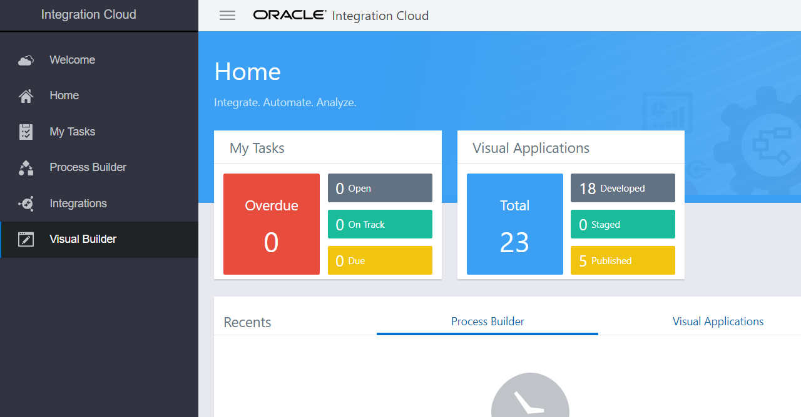

# Lab 600 - Add VBCS logic to Trigger PCS Approval Workflow

---

## Introduction

This is the sixth of several labs that are part of the **AIC Integration Development** workshop. 

In this lab, you will modify the VBCS Web Application created in **Lab 400** and call the approval workflow (created in the previous **Lab 500**).

Here is a description of what is happening with this Lab :

The form based web application will call a REST service (post/orders) that returns an order status as the response. If the order status is returned as **ORDER_SUSPENDED**, a PCS approval workflow will be called to review the order and manually approve or decline the same.

## Objectives

- Learn how to call a PCS workflow from a VBCS web application

## Required Artifacts

- The following lab and an Oracle Integration Cloud account that will be supplied by your instructor
- Completion of the *Lab 400* and previous *Lab 500*

>***NOTE:*** Use Chrome or IE for the labs preferably, Firefox may cause issues in development

## Modify the VBCS web application to call a PCS Approval Wofkflow

### Login to AIC Integration Home Page

>***NOTE :*** The **User Name** and **Password** values will be given to you by your instructor. See _Lab 100 **1.1.1**: Login to your Oracle Cloud Account_ for more information on how to sign into the AIC Integration home page

------

You will now be presented with the AIC Service Console from which you will be performing the rest of this workshop lab.

### Login to VBCS instance

- Click on the Visual Builder link on the left

  

- The Visual Builder console should appear as below

  

### Open the VBCS application

- Click `Online Shopping` to open the Visual Application

  

  ***NOTE:*** Application name will be as created in **Lab 400**. For example - `Online Shopping VL` where `VL` is the suffix and are the first letters of my first and last name.

### Create a PCS server connection and register the deployed process to be called

- Click on **Process Cloud** on the home page and click on **Process Server** on the left

  

- Note that the process server connection to the PCS instance has already been made. Click on **Test Connection** and check that the connection is successful. Click on the **`+`** icon on the left beside **Processes** to register the process that we created in **Lab 500**

  

- In the window that opens, search for our process (created in Lab 500) by typing `Online` against **Deployed Processes**. Click and select the exact deployed process (note the **Revision** - this should match the revision version that you deployed during the Lab 500), give it an alias, for example - `OnlineShoppingPCSVL` where `VL` is the suffix and are the first letters of my first and last name. Click on **Add** to register the process to our VBCS application. Close the window by clicking the **`X`** icon on the top right hand corner or using the **Close** button

  

- Note that the process alias is added under the **Process Server** and clicking it will reveal further details about the process on the right

  

### Start the PCS process when ICS REST service returns a suspended order

- Click on web applications icon on the left and select our form by clicking on **main-start** under `shoppingportal/flow/main`. Click on **Actions** (flag icon) and select **ButtonClickAction**

  

- Scroll down in the diagram to the end where the REST endpoint is called as shown in the screenshot below -

  

*Now, we know that a successful REST call results in an `ORDER_PROCESSED` or an `ORDER_SUSPENDED` response. If the order is suspended as returned with an `ORDER_SUSPENDED` response, we will start the PCS approval process for manual review and approval. This is coded in the **Assign Variables** of the `success` branch under **Call REST Endpoint**. Let us add an **If** condition below this **Assign Variables** to check if the order is suspended and an `ORDER_SUSPENDED` response was returned by the REST call.*

- Drag and drop an **If** under **Logic** to the last **`+`** symbol

  

- Bring up the expression editor to check for the order suspended condition. Click on **`(x)`** and click on **Open Expression Editor** under **Condition**

  

- In the window that opens, enter `{{ $application.functions.isOrderSuspended() }}` on the blank canvas. Place the cursor inside `()` and drag and drop the **response** element under `Results/callRestEndpoint1/body` on the left-hand side into `()`

  

- Make sure that the condition is updated to `{{ $application.functions.isOrderSuspended($chain.results.callRestEndpoint1.body.response) }}`. Click **Save**

  

- Drag and drop a **Start Process** under **Process** to the **`+`** symbol under the `true` branch of the **If**

  
  
- Click on **Select Process** on the right

  

- Select the **Submit Request** interface under `Process Aliases/OnlineShoppingPCS` and click **Select**

  

- See that the interface is selected but the input parameters are not yet assigned to trigger the process interface. Click **Assign** to assign the required input parameters

  

- Click on `Model` under `orderInfo` under **Page** variables on the left-hand side and drag and drop it to `model` on the right-hand side under **Parameters**

  

***Note here that you can also use the Page variables directly for the mapping instead of using the orderInfo variable.***

- Map the following fields similar to the above step -

  `orderInfo/OrderId` -> `orderID`

  `orderInfo/NumberOfItems` -> `noOfitems`

  `orderInfo/UnitPrice` -> `unitPrice`

  `orderInfo/ShippingState` -> `shippingState`

  `orderInfo/ReturnReason` -> `returnReason`

  `responseCode/response` -> `status`

***Note that the status can also be hardcoded to ORDER_SUSPENDED.***

  The sreen will look like this after the mappings -

  

- Check that all the input parameters for the interface are now shown as mapped

  

- Click on the `shoppingportal` application on the left and switch to the **JS** view to add Javascript. Add the following function -

  ```javascript
    AppModule.prototype.isOrderSuspended = function(orderStatus) {
      if (orderStatus === "ORDER_SUSPENDED") {
        return true;
      } else {
        return false;
        }
    };
  ```

  

- Click on web applications icon on the left and select our form by clicking on **main-start** under `shoppingportal/flow/main`. You can either work in the **Live** mode or by clicking the **Run**  icon to open a new browser window with the form. Click on **Submit Order** with the following input -

  ```javascript
    Order ID      : 1N1
    Model         : PCS Test
    Quantity      : 2
    Price         : 300
    Ship To       : AK
    Return Reason : PCS Return.
  ```

  You can see the web-service (REST) call goes through and a status is returned such as `ORDER_SUSPENDED` or `ORDER_PROCESSED`. Try submitting the order until a `ORDER_SUSPENDED` is returned

  

  

- At this point, the PCS workflow `OnlineShopProcessApproval` would have been triggerd due to a suspended order being returned from the ICS REST call with the status `ORDER_SUSPENDED`. You would have received an email with a link to PCS to view/approve/reject the order. You can click on the **View Online** link to directly open the task form

  

- As an alternative to the step above, or in case you do not have access to the email box or did not receive an email, you can manage the PCS tasks directly from VBCS. Back in the **Processes** tab, click on the hamburger icon and click on **Manage Processes**. This will take you to the PCS tasks page

  

- Click on the task to open the task form

  

- Review the task form and see that the workflow has been triggered for the same order that was suspended. This can be checked with the `Order ID` which is `1N1` that we previously submitted

  

- Scroll down to see further details. Add an optional comment and approve/reject the order after review

  

- Click **Approve** and see that the order has been approved with a green ribboned status. Also note that the task is also removed from the list of tasks to be worked on

  

- You would again receive an email saying that the task was successfully completed

  

---

You have now completed the second VBCS Lab (600) from the AIC Developer Workshop.

Congratulations! You should now have a much better understanding of how to invoke PCS workflows from VBCS to initiate business decisions and approvals.
