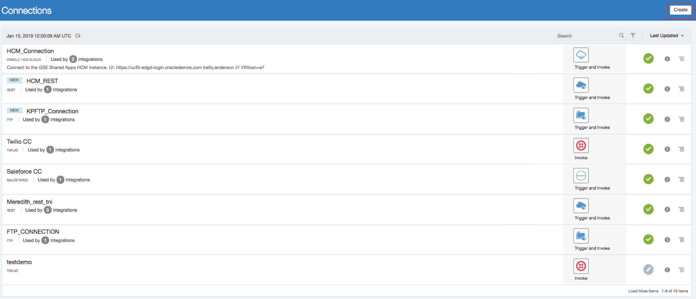
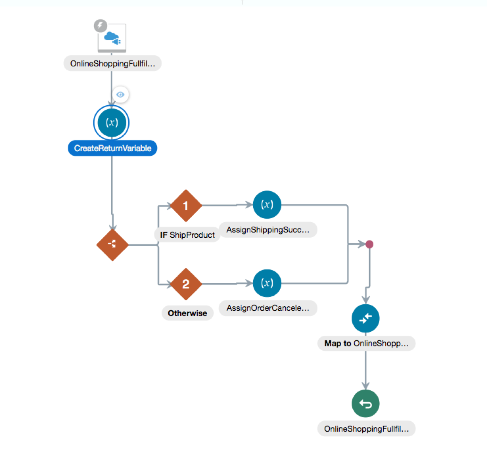
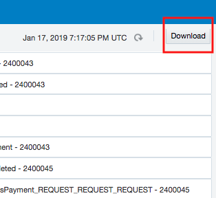

# **Lab 100 - Explore Oracle Integration Cloud**

---

## Objectives

- Explore Oracle Integration Cloud (OIC) to become familiar with its service console and functionality

## Required Artifacts

- The following lab and an Oracle Public Cloud account that will be supplied by your instructor

## Introduction

This is the first of several labs that are part of the **OIC Development** workshop. 

In this lab, we will explore the main parts of OIC.  You will acquire a good overview of OIC, the next generation integration platform. You will explore various consoles and tools available to interact with your integration. The exercise will get your familiar with all the tooling available to work with this cloud service. 

We’ll look at the following:
1.	Oracle Cloud Services Dashboard
2.	OIC Designer User Interface
3.	OIC Monitoring User Interface

Let’s start by logging into the Oracle Integration Cloud and explore OIC Dashboard

## 1.1: Explore the Oracle Integration Cloud Dashboard

### **1.1.1**: Login to your Oracle Cloud account

---

**1.1.1.1** From your browser (Firefox or Chrome recommended) go to the following URL:
<https://cloud.oracle.com>

**1.1.1.2** Click _Sign In_ in the upper right hand corner of the browser
**IMPORTANT** - Make sure `Cloud Account with Identity Cloud Service` is selected Under Cloud Account, Enter **Cloud Account Name** provided by your instructor and Click on `My Services >` 

**1.1.1.3** Enter your `User Name` and `Password` and click **Sign In**

***NOTE:*** the **User Name and Password** values will be given to you by your instructor.

  

**1.1.1.4** You will be presented with a Dashboard displaying the various cloud services available to this account.

**NOTE:** The Cloud Services dashboard is intended to be used by the *Cloud Administrator* user role.  The Cloud Administrator is responsible for adding users, service instances, and monitoring usage of the Oracle cloud service account.  Developers and Operations roles will go directly to the service console link, not through the service dashboard.

**1.1.1.5** The Service Administrator can also look at Billing and Monitoring MetrOIC to understand how the service is being consumed by your Enterprise

**1.1.1.6** Selecting `View Details` link will take you to the Service Overview page where there are links for Billing and Monitoring Services. As this is a demonstration account, there is no Billing and Monitoring information available.

**1.1.1.7**  To get to Oracle Integration Cloud (OIC) service console where you will work on developing the integration, click on the `Open Service Console`. This will display OIC Service Instance Page listing all OIC Services provisioned in the Cloud Account.

**1.1.1.8**  Click on Hamburger menu for OIC Instance `j2cOICpcs` and Select the `Open Integration Cloud Home Page` link to go to the OIC Welcome Page.  

 

**NOTE:** If you get an **Authentication Required** Pop-Up Window to re-enter user credentials, select `Cancel` to continue. 

**1.1.1.9**  Click on `Home` Link to go to OIC Home Page

 

**1.1.1.10**  Click on `Integrations` and you will now be presented with the Integration Service Console from which you will be performing the rest of this workshop lab.

 

**1.1.1.11** You can click on `Connections` to go to the connections page and continue with Step **1.2.1.2** below or follow instructions from step **1.2**

## 1.2: Explore the OIC Designer User Interface
---
**NOTE** If you want OIC users to go directly to OIC Home Page, you can bookmark the Home Page URL

OIC Integration Home Page - https://**OIC Instance URL**/ic/integration/home/faces/global

Open a new Browser Tab and enter **OIC Home Page URL** provided by your instructor

 

### **1.2.1:**	Explore OIC Connections

---

**1.2.1.1:** Select the `Connections` graphic in the designer portal

  

**1.2.1.2:** To find the connections that we will be using in this lab type **shop** into the search bar and hit enter. Make note of the connections you see.

**1.2.1.4:** Click on the `Create` button in the upper-right so we can see all the different OIC Connectors that are available.

 

**1.2.1.5:** Scroll through the list of connection types that are available in OIC.

**1.2.1.6:** Note that the icons with the plug are those that support the OIC Connectivity Agent for those service types which are not in the cloud, but on-premise, behind the company firewall.

**1.2.1.7:** When you are done browsing, select the “Cancel” button to dismiss the “Select an Adapter” dialog.

### **1.2.2:**	Explore OIC Integrations

---

**1.2.2.1** Select the `Hamburger` menu icon on top of the OIC Service Console to go to the `Designer` menu.

**1.2.2.2** Select the `Integrations` menu selection

**1.2.2.3** Select the `Hamburger` menu icon again to dismiss the left-hand navigation and get some screen real-estate back.

**1.2.2.4** Make note of the integrations that have been created. In this lab we will be working with the integration called **Online Shopping App Fulfillment**.

**Note:** If you do not see **Online Shopping App Fulfillment** click the Load More option or filter by the word **shop** at the top right of the page. 

**NOTE** Before we get into how we build an integration a few things to note about what an integration is and what it does. An integration is an API or Application Programming Interface. Essentially an API is the middle man for data between aplications. The structure is that you send a request, it does some business logic on the backend or talks to a database and returns a response. What we will be looking at is the request, response and logic inside of an API.

**1.2.2.5** Open the integration `Online Shopping App Fulfillment` by clicking on the integration name.  We want to see what it looks like.  Since the integration is already active, we’ll be looking at it in `Viewing` mode.  There will be a warning that _Edit is not possible_ in a yellow box displayed along the top. You can dismiss the warning bar by selecting the little "X" on the very right of the warning.

**1.2.2.6** You can see that this orchestration has many steps in it.  The view of the orchestration is *Zoom to Fit* in the browser real estate.  In order to get a closer view of the individual steps, you can either scroll with your mouse wheel to zoom in and out, or you can use the *-/+* slider in the top right of the designer.

**1.2.2.7** Try zooming in and out by using both methods.  

**1.2.2.8** If you get zoomed-in too close and want to pan, you’ll be able to move around the orchestration using the `Pan` window by clicking on the dark area and moving around.

**1.2.2.9** Select the `Lightning` icon and the drawing gets reset to a zoomed in view with the orchestration trigger at the very top.  This is a nice feature if you don't know where you are in a large orchestration.

**1.2.2.10** Try selecting the `Maximize` viewing control on the very right of the view control bar.  This will hide some of the detail on top of the screen to give the designer the most area to work in.  Hitting the `Maximize` button again will toggle that view.

**1.2.2.11** Let’s look at some of the components of the integration.  Select the `Maximize` view button again to restore the window.

**1.2.2.12** The component at the very top of the orchestration is the `Trigger`.  The trigger is representative of the connector that’s sending data into the integration.  It is highlighted with a little lightning bolt signifying an incoming event.

**1.2.2.13** If you hover over the Trigger node, you can see the details.  Our trigger is a REST connector type.  It is called *OnlineShoppingFulfillment* and it is using the connection named *Online Shopping Fulfillment* that we looked at before in the Connection section of the OIC Designer.

**1.2.2.14** If you click on the `Trigger`, a pop-up will appear with a view icon in the shape of an eye.  Select the `eye` so we can walk through the wizard that was used to setup the REST trigger.

**1.2.2.15** Since the trigger has already been created, you will be started on the last page of the configuration, the **Summary**. The summary contains the basic information about the trigger – it’s name and description. Click *Basic Info* on the left navigation bar.

**1.2.2.16** The basic info contains the **name** of the endpoint, the **description**, the endpoint's **relative URI**, the **action** to be performed and the **options** for setting up the trigger such as adding parameters and receiving a response. 

**1.2.2.17** Select the `Next` button to see the **Request Parameters** that were configured for this REST Trigger.  Here information such as request  objects are shown.  In our case, we set three `Query Parameters`.

**1.2.2.18** Select the `Next` button to see the **Response** configuration. Here we set the information to be returned in our **Response Payload**. We chose the fomat to be of type JSON and used a JSON Sample to determine the payload. Click on `<<<inline>>>` to see the sample payload. 

**1.2.2.19** We can see that the JSON payload contains one item, called **"response"**. Here we set it to a value only for understandings sake. What we are really doing is creating a variable called response and initializing the value to an empty string for us to fill throughout our integration and send as our response.

**1.2.2.20** Select `Next` again to see the **Summary** of the Trigger’s configuration. Then select the `Close` button to dismiss the Trigger view wizard.

**1.2.2.21** Now let’s view the next node down in the integration.  This is an *Assign* node.  The job of this Assign activity is to initialize variables that will be used in our application. Again we are going to click on the eye to see what our assign activity does.

**1.2.2.22** The variables defined in this Assign activity are view only.  Using variables rather than hard-coding these in the mapping for the adapter is preferable because they can be re-used throughout the integration and easily edited to affect the entire integration. Note that we are creating a variable called **ReturnValue**.

**1.2.2.23** Select the `Close` button in the upper-right to go back to the view of the orchestration.

**1.2.2.24** Pan down to `Switch` statement. You can tell it is a switch statement because it creates multiple possible paths based on whether certain conditional statemets are true or false. We can check those parameters by clicking on the brown "1" and then clicking on the eye to inspect. Here we can see the conditional statement for continuing on that path. The logic behind the switch statement is as follows: If **FulfillmentAction = "ShipProduct"** then take this path, if not take the other path.

**1.2.2.25** By continuing down the first path (the one on top) we see that we hit another assign function called **AssignShippingSuccessfulReturn**. Where we change the **ReturnValue** variable to **"SHIPPING_SUCCESS"**. So we see that depending on if FulfillmentAction = "ShipProduct" or not we change the return value of our integration.

**1.2.2.26** Next we will take a look into our `map`. What you’ll see in the mapper is the possible input variables on the left and the response payload on the right.

 **1.2.2.27** If you want to get a visual depiction of where a Target variable has been mapped from, select the little green checkbox to the very left of the Target variable.  This will make a line visible from the Source variable to the Target. As we can see we set our **response** = **ReturnValue** variable that we set in our initial JSON request payload.

**1.2.2.28** Once you are done exploring this mapping, select the `Close` button in the upper-right to return back to the Integration orchestration.

**1.2.2.29** We’ve spent some time exploring the *Online Shopping App Fulfillment* integration. Now we are ready to look into integration monitoring.

## 1.3: Explore the OIC Monitoring User Interface

### **1.3.1:**	Open OIC Monitoring Console

---

**1.3.3.1** Select the `Hamburger` menu icon on top of the OIC Service Console to go to the `Monitoring` menu.

**1.3.3.2** Select the `DESIGNER` menu selection at the top to go back to the main left-hand navigation menu level.

**1.3.3.3** Next, select the `Monitoring` menu selection to go to the OIC monitoring capabilities.

**1.3.3.4** Next, select the `Dashboards` selection to go to the main OIC monitoring dashboard page.

### **1.3.2:**	Explore OIC Monitoring Console - Dashboard

---

**1.3.2.1** You will be presented with the OIC Monitoring Dashboard.  Observe the various data that is available from this dashboard such as *% of successful messages*, *# of Currently Used Connections*, etc.

  

**1.3.2.2** On the right side of the `Dashboard` there are links where you can view the `Activity Stream`, Download the logs, and Download an Incident if a service request needs to be raised.

**1.3.2.3** Click on the Activity Stream link

**1.3.2.4** You will be directed to the `Integration` screen where you can view a summary of all messages that have passed through OIC in a tabular form.

**1.3.2.5** In the `Activity Stream` you can see the steps in the *Create EBS Order* integration that were executed and whether or not they were successful.

### **1.3.3:**	Explore OIC Monitoring Console - Logfiles

---

**1.3.3.1** In order to see the details of the payload that passed through the OIC integration, you need to download the Activity Stream Log from the `Download Logs` link on the right of the Activity Stream.

**1.3.3.2** Select the `Download Activity Stream` link and then save the zipfile to a location on your workstation such as *C:\temp* (Windows path)

**1.3.3.3** A downloading informational message will be shown with a blue background at the top of the page.  You can dismiss it by selecting the "X" at the right of the message bar.

**1.3.3.4** Extract the zipfile and you’ll see that there are 2 directories of logfiles – this is because the OIC instance is running on a cluster of 2 servers for high availability.

**1.3.3.5** Navigate into one of the server directories and examine the `ics-flow.log` file in your favorite text editor.

**1.3.3.6** Here is a view of the end of the *ics-flow.log* file in the *Notepad++* text editor showing the response given by EBS of the order payload after a successful execution of the create order API call:

**1.3.3.7** This logfile is helpful for investigation during development or runtime analysis.  The capture of the runtime payloads can be turned on or off during activation of the OIC integration where you are prompted whether or not you want to save the payloads.

### **1.3.4:**	Explore OIC Monitoring Console - Integrations

---

**1.3.4.1** Back in the OIC Monitoring console, select `Integrations` from the left-hand navigation.

**1.3.4.2** Note that all the statistOIC of the are shown.

### **1.3.5:**	Explore OIC Monitoring Console - Tracking

---

**1.3.5.1** Select the `Tracking` link in the navigation bar on the left

**1.3.5.2** The OIC `Tracking` monitor page shows all integration flows that have been executed.

**1.3.5.3** Select the chevron just to the right of the *Tracking* label at the top of the page to change the granularity of the Tracking report to `Last 1 Hour`

**1.3.5.4** Next, drill into a `COMPLETED` integration flow by selecting the integration name.

**1.3.5.5** We can now see that all steps in the this OIC integration flow were successful because the arrow is green highlighting all the orchestration flow steps.

**1.3.5.6** Select the `Close` button to go back to the OIC monitoring page.

**1.3.5.7** We are now done exploring the OIC monitoring features.

You now have used Oracle Integration Cloud to explore an integration. 

You have now completed Lab 100 of the OIC Developer Workshop. In the next lab, we are going to build a 'hello world' echo service.

- This Lab is now completed.
