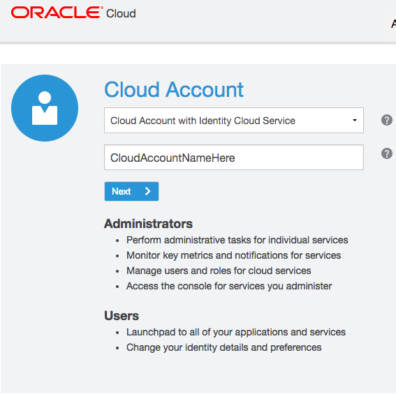
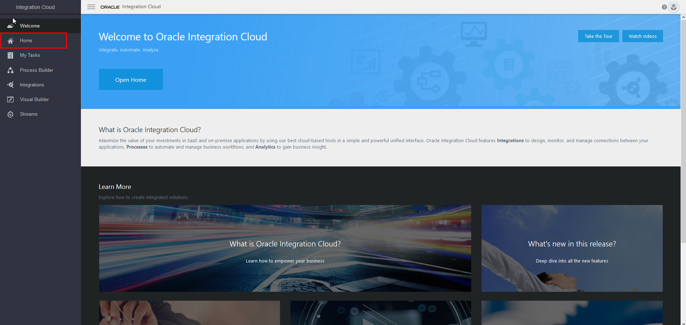
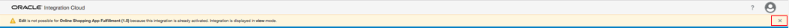
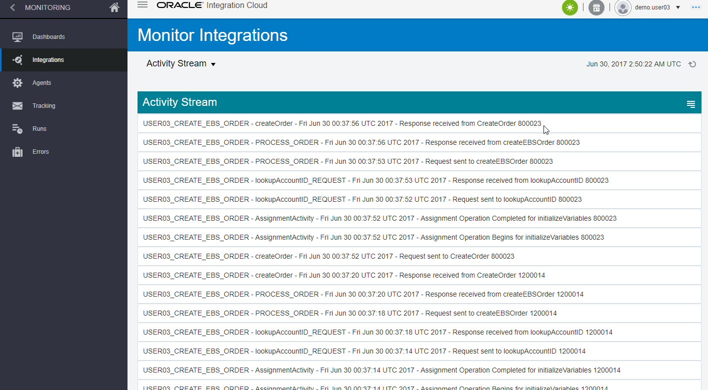
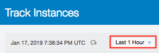

# **Lab 100 - Explore Oracle Integration Cloud**

## **Introduction**

This is the first of several labs that are part of the **OIC Development** workshop. 

In this lab, we will explore the main parts of Oracle Integration Cloud (OIC).  You will acquire a good overview of OIC, the next generation integration platform. You will explore various consoles and tools available to interact with your integration. The exercise will get your familiar with all the tooling available to work with this cloud service. 

We’ll look at the following:
1.	Oracle Cloud Services Dashboard
2.	OIC Designer User Interface (Integrations and Connections)
3.	OIC Monitoring User Interface

Let’s start by logging into the Oracle Integration Cloud and explore OIC Dashboard

## **Objectives**

- Explore Oracle Integration Cloud (OIC) to become familiar with its service console and functionality

## **Required Artifacts**

- The following lab and an Oracle Public Cloud account that will be supplied by your instructor

### **Pre-Requisites**

- This lab assumes that you have already completed [Lab000](/ics000.md)

# **Explore the Oracle Integration Cloud**

## **100.1: Explore the Dashboard**

**100.1.1:** From your browser (Firefox or Chrome recommended) go to the following URL:
<https://cloud.oracle.com>

**100.1.2:** Click `Sign In` in the upper right hand corner of the browser
**IMPORTANT** - Make sure `Cloud Account with Identity Cloud Service` is selected Under Cloud Account, Enter **Cloud Account Name** provided by your instructor and Click on the `Next` button

**100.1.3:** Enter the ***Username*** and ***Password*** provided to you by your instructor then click **`Sign In`**

  

**100.1.4:** You will be presented with a Dashboard displaying the various cloud services available to this account

> **NOTE:** The Cloud Services dashboard is intended to be used by the *Cloud Administrator* user role.  The Cloud Administrator is responsible for adding users, service instances, and monitoring usage of the Oracle cloud service account.  Developers and Operations roles will go directly to the service console link (https://{**InstanceName**}-{**CloudAccountName**}.integration.ocp.oraclecloud.com/ic/home/), not through the service dashboard

**100.1.5:** The Service Administrator can also look at Billing and Monitoring Metrics to understand how the service is being consumed by your Enterprise. Selecting `View Details` link will take you to the Service Overview page where there are links for Billing and Monitoring Services
> As this is a demonstration account, there is no Billing and Monitoring information available

**100.1.6:**  To get to the OIC Home Page where you will work on developing the integration, we have to go through the service console. Click on `Open Service Console` to display the OIC Service Instance Page listing all OIC Services provisioned in the Cloud Account

**100.1.7:**  Click on the `Hamburger` menu  for the OIC Instance your lab proctor has instructed and select the `Open Integration Cloud Home Page` link to go to the OIC Welcome Page

> **NOTE:** If you get an **Authentication Required** Pop-Up Window to re-enter user credentials, select `Cancel` to continue. 

**100.1.8:**  Click on the `Home` link to go to the OIC Home Page to explore the dashboard

 

**100.1.9:**  Click on `Integrations` and you will now be presented with the Integration Console from which you will be performing the rest of this lab

 

# **Explore the OIC Designer User Interface**

## **100.2: Explore Connections**

**100.2.1:** From the integration designer menu, select connections

**100.2.2:** To find the connections that we will be using in this lab, type the keyword **shop** into the search bar and click on the magnifying glass icon  then make note of the connections you see. You can clear the search bar when you are finished

**100.2.3:** Click on the `Create` button in the upper-right so we can see all the prebuilt OIC Adapters that are available

 

**100.2.4:** Scroll through the list of available adapters. When you are done browsing, select the `Cancel` button to dismiss the “Select an Adapter” dialog
> **NOTE:** The icons with the plug support the OIC Connectivity Agent for those service types which are not in the cloud, but on-premise, behind the company firewall

## **100.3: Explore Integrations**

**100.3.1:** If not already showing, select the `Hamburger` menu icon  on top of the OIC Service Console to reveal the `Designer` menu

**100.3.2:** Select the `Integrations` menu item

**100.3.3:** Select the `Hamburger` menu icon  again to dismiss the left-hand navigation and get some screen real-estate back

> **NOTE:** In this lab we will be working with the integration called **Online Shopping App Fulfillment**. If you do not see **Online Shopping App Fulfillment** click the Load More option or filter by the keyword **shop** at the top right of the page. 

> **NOTE:** Before we get into how we build an integration a few things to note about what an integration is and what it does. An integration is an API or Application Programming Interface. Essentially an API is the middle man for data between aplications. The structure is that you send a request, it does some business logic on the backend or talks to a database and returns a response. What we will be looking at is the request, response and logic inside of an API.

**100.3.4:** Open the integration `Online Shopping App Fulfillment` by clicking on the integration name. Since the integration is already active, we’ll be viewing it in `View Only` mode.  There will be a yellow warning banner at the top that states along the lines that _Edit is not possible for..._ 
- You can dismiss the warning bar by selecting the little "X" on the very right of the warning.

**100.3.5:** You can see that this orchestration has many steps in it.  The view of the orchestration is *Zoom to Fit* in the browser real estate.  In order to get a closer view of the individual steps, you can either scroll with your mouse wheel to zoom in and out, or you can use the *-/+* slider in the top right of the designer

- ***Try zooming in and out by using both methods***

**100.3.6:** If you get zoomed-in too close and want to pan, you’ll be able to move around the orchestration using the `Pan` window by clicking on the dark area and moving around

**100.3.7:** Select the `Lightning` icon to reset to a zoomed in view with the orchestration trigger at the very top.  This is a nice feature if you don't know where you are in a large orchestration

**100.3.8:** 
- Try selecting the `Maximize` viewing control on the very right of the view control bar.  
This will hide some of the detail on top of the screen to give the designer the most area to work in. 
- Clicking on the `Maximize` button again will toggle that view.

- Now, let’s look at some of the components of the integration. Select the `Maximize` view button again to restore the window.

 

**100.3.9:** The component at the very top of the orchestration is the ***Trigger***
- The trigger is representative of the connector that’s sending data into the integration.  It is highlighted with a little lightning bolt signifying an incoming event.

**100.3.10:** If you hover over the Trigger node, you can see the details.  Our trigger is a REST connector called *OnlineShoppingFulfillment* and it is using the connection named *Online Shopping Fulfillment* that we previously observed in the Connection section of the OIC Designer

**100.3.11:** If you click on the `Trigger`, a pop-up will appear with a view icon in the shape of an eye.  Select the `eye` icon so we can walk through the wizard that was used to setup the node

**100.3.12:** Since the trigger has already been created, the window will open to the last page of the configuration, the **Summary**. The summary contains basic information about the trigger that was configured on the other pages. Click the *`Basic Info`* tab on the left navigation bar

**100.3.13:** The basic info contains: the **name** of the endpoint, the **description**, the endpoint's **relative URI**, the **action** to be performed, and the **options** for setting up the trigger such as adding parameters and receiving a response

**100.3.14:** Select the `Next` button to see the **Request Parameters** that were configured for this REST Trigger. In our case, we set three **Query Parameters**

**100.3.15:** Select the `Next` button to see the **Response** configuration. Here we set the information to be returned in our **Response Payload**. We chose the format to be of type JSON and used a JSON Sample to determine the payload. Click on `<<<inline>>>` to see the sample payload

**100.3.16:** We can see that the JSON payload contains one item, called **"response"**. Here we set it to a value only for understandings sake as this is used in the documentation OIC creates. What we are really doing is creating a variable called response and initializing the value to an empty string for us to fill throughout our integration and send as our response

**100.3.17:** Select `Next` again to be returned to the **Summary** of the Trigger’s configuration. Then, select the `Close` button to dismiss the Trigger view wizard.

**100.3.18:** Now let’s view the next downstream node which is an *Assign* action. The job of this Assign activity is to initialize variables that will be used in our application. Again we are going to click on the eye to see what our assign activity accomplishes

**100.3.19:** The variables defined in this Assign activity are view only.  Using variables rather than hard-coding these in the mapping for the adapter is preferable because they can be re-used throughout the integration and easily edited to affect the entire integration

> ***NOTE:*** that we are creating a variable called **ReturnValue**

- Select the `Close` button in the upper-right to return to the view of the orchestration

**100.3.20:** Pan down to `Switch` statement which creates multiple possible paths based on certain conditional statemets being true or false. 
- We can check those parameters by clicking on the brown "`1`" and then clicking on the `eye` to inspect
- Here we can see the conditional statement for continuing on that path. 
    - The logic behind the switch statement is as follows: If **FulfillmentAction = "ShipProduct"** then take this path, if not take the other path.

**100.3.21:** By continuing down the first path (the one on top) we see that we hit another assign function called **AssignShippingSuccessfulReturn** where we change the **ReturnValue** variable to **"SHIPPING_SUCCESS"**
- Depending on if FulfillmentAction = "ShipProduct" or not we change the return value of our integration.

**100.3.22:** Next we will take a look into our `mapping`  action.
- What you’ll see in the mapper is the possible input variables on the left and the response payload on the right.

 **100.3.23:** If you want to get a visual depiction of where in the _Source_ a _Target_ variable has been mapped, select the little green checkbox to the very left of the Target variable. This will make a line visible from the Source variable to the Target. As we can see we set our **response** = **ReturnValue** variable that we set in our initial JSON request payload.

**100.3.24:** 
- Once you are done exploring this mapping, select the `Close` button in the upper-right to be returned to the Integration orchestration.

- We’ve spent some time exploring the *Online Shopping App Fulfillment* integration. Now we are ready to look into integration monitoring.

# **Explore the OIC Monitoring User Interface**

## **100.4a: Explore Monitoring Console**

**100.4a.1:** From the integration designer menu, select the `Designer` menu item to navigate to the secondary menu level

**100.4a.3:** Next, select the `Monitoring` menu item to navigate to the OIC monitoring capabilities

**100.4a.4:** Next, select the `Dashboards` menu item to navigate to the main OIC monitoring dashboard page

## **100.4b: Explore Monitoring Dashboard**

**100.4b.1:** You will be presented with the OIC Monitoring Dashboard
- Observe the various data that is available from this dashboard such as:
    - *percentage of successful messages*
    - *number of currently used connections*

  

**100.4b.2:** On the right side of the Dashboard there are links where you can view the _Activity Stream_, _Download the logs_, and _Download Incident_ if a service request needs to be raised

**100.4b.3:** Click on the _`Activity Stream`_ link

**100.4b.4:** You will be directed to the *Integration* screen where you can view a summary of all messages that have passed through OIC in a tabular form
- In the *Activity Stream* below, you can see the steps in the *Create EBS Order* integration that were executed and whether or not they were successful

## **100.4c: Explore Monitoring Logfiles**

**100.4c.1:** In order to see the details of the payload that passed through the OIC integration, you need to download the Activity Stream Log from the `Download Logs` link on the right of the Activity Stream.

**100.4c.2:** Select the `Download` link and then save the zip file to a location on your workstation such as *C:\temp* (Windows path)

**100.4c.3:** An informational message will be shown with a blue background at the top of the page: You can dismiss it by selecting the "`X`" at the right of the message bar

**100.4c.4:** Extract the zip file 
- You will see that there are two directories of log files – this is because the OIC instance is running on a cluster of two servers for high availability

**100.4c.5:** Navigate into one of the server directories and examine the `ics-flow.log` file in your favorite text editor

**100.4c.6:** Here is a view of the end of the *ics-flow.log* file in the *Notepad++* text editor showing the response given by EBS of the order payload after a successful execution of the create order API call:

**100.4c.7:** This logfile is helpful for investigation during development or runtime analysis.  The capture of the runtime payloads can be turned on or off during activation of the OIC integration where you are prompted whether or not you want to save the payloads

## **100.4d: Explore Monitoring Integrations**

**100.4d.1:** Back in the OIC Monitoring console, select `Integrations` from the left-hand navigation

**100.4d.2:** Review all the statistics that are shown

## **100.4e: Explore Monitoring Tracking**

**100.4e.1:** Select the `Tracking` link in the navigation bar on the left. The OIC `Tracking` monitor page shows all of the individual integration flows that have been executed

**100.4e.2:** Select the chevron just to the right of the *Tracking* label at the top of the page to change the granularity of the Tracking report to `Last 1 Hour`

**100.4e.3:** Next, drill into a `COMPLETED` integration flow by selecting the integration name.

**100.4e.4:** We can now see that all steps in this OIC integration flow were successful because of the green highlighting all the orchestration flow steps

**100.4e.5:** Select the `Close` button to go back to the OIC monitoring page.

We are now done exploring the OIC monitoring features.

--- 

# **THIS LAB IS NOW COMPLETED. PLEASE SEE YOUR INSTRUCTOR FOR FURTHER INSTRUCTIONS**
> In the next lab, you will learn how to create a basic 'hello world' echo service
