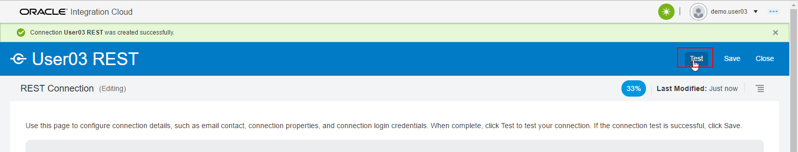
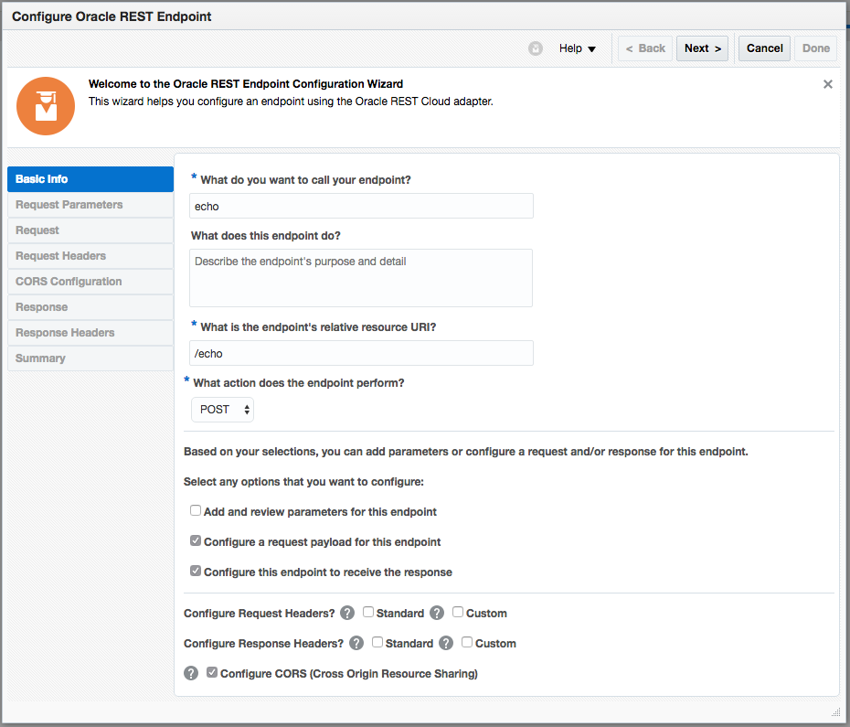
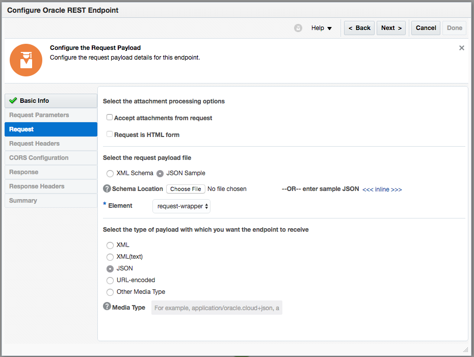
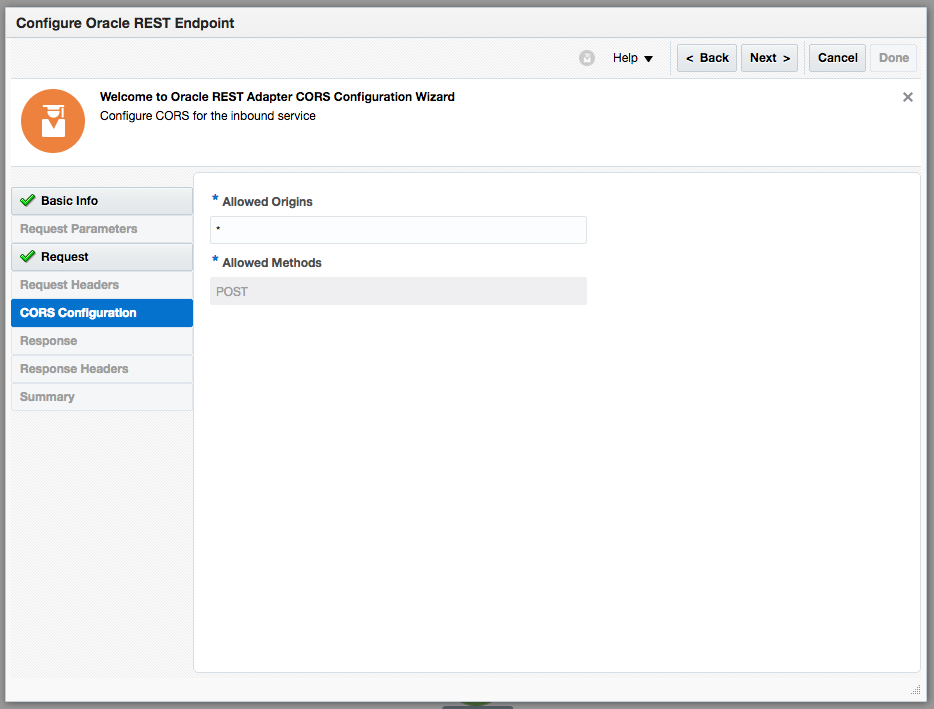
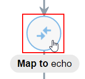
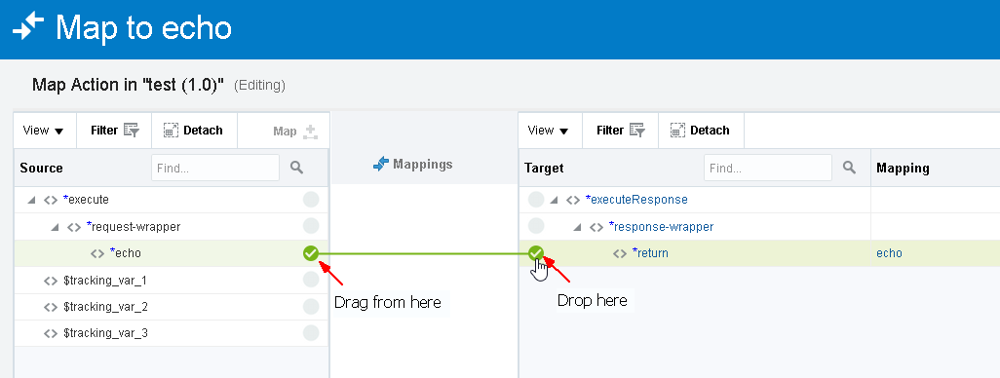
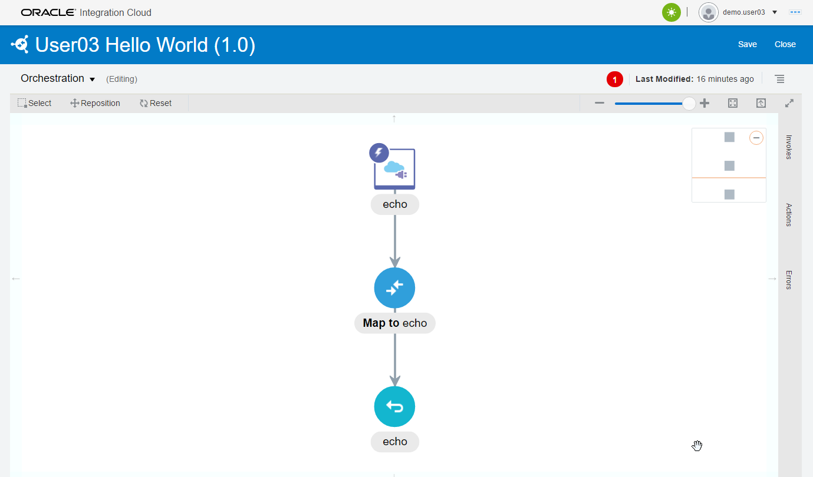
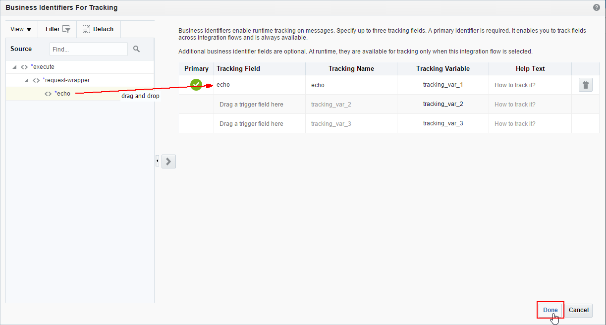
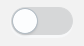

# Lab 200: Basic OIC Development (Hello World Integration)

## Introduction

This is the second of several labs that are part of the **OIC Integration Development** Workshop. 

In this lab, you will learn how to create a basic 'hello world' echo service, using a basic orchestration. 

The OIC integration that we'll be building is shown in the following picture:


Here is a description of what is happening with this integration:

Postman will be used to test the exposed REST API Service endpoint of the OIC integration called *UserXX Hello World* (where XX will be the Number assigned by the Instructor).  This integration has 1 connection.  The incoming message is received by the incoming *UserXX REST* REST Connection.  The integration flow will take the Input String and echo it back in the REST API response.

## Objectives

- Create your first integration to echo an input to the output 

## Required Artifacts

- The following lab and an Oracle Public Cloud account that will be supplied by your instructor.

### Login to OIC Integration Home Page

>***NOTE:*** the **User Name** and **Password** values will be given to you by your instructor. See _Lab 100 **1.1.1**: Login to your Oracle Cloud Account_ for more information on how to sign into the OIC home page

  

### **2.1.1** Create a REST Connection

In this first part of the lab, we will create a connection :

Let’s start by logging into the Oracle Cloud account using your allocated user (demo.user1.10)  

>**NOTE:** All the screenshots use the _demo.user10_ account. Replace the _demo.user10_ with your assigned account to validate the steps illustrated in the screenshots. 

---

**2.1.1.1** Click on **Itegrations** tab followed by  the **Connection** section from designer page as shown below 


 

**2.1.1.2** Click on **Create** in the upper right of the screen

 

**2.1.1.3** Select the **REST** Connection, by either doing a search, or by scrolling down to the **REST** connection, by clicking on the **Select** button of the **REST** connection.


**2.1.1.4** Fill in the information for the new connection 

- **Name** in the form of _UserXX REST_ where XX is the number in your allocated user.
- **Role** _Trigger_ since we going to use the connection as a trigger to start the integration

 

**2.1.1.5** click **Create**

 

>***Note*** The default security configuration is set to **Basic Authentication**, which by the way, is the only option available for REST trigger connections. When invoking the trigger, we will use our OIC username/password. 

**2.1.1.6** Click on **Test** 



**2.1.1.7** Click **Save** 

 

**2.1.1.8** Click on the **Close** link in the upper right

Your first connection appears in the list of configured connections and is even marked as **New** !

 

**2.1.1.9** Click on the **Integrations** link in the upper left to get back to the Integration page

 

### **2.2.1**  Create New  Integration

**2.2.1.1** Click on the **Create** button in the upper right

 

**2.2.1.2** In the **Create Integration - Select a Style/Pattern** popup, select the **Orchestration**


**2.2.1.3** Fill in the form with the following information

- _What triggers this integration?_ **Application event or business object**
- _Name_ **UserXX Hello World**

 

**2.2.1.4** Click on **Create**


**2.2.1.5** In the **Triggers** panel, expand the **REST(nn)** heading, and find your connection, under **REST**

Drag and drop your connection **UserXX REST** in to the circle with plus sign, you will see the plus sign twirling when ready to drop 
 


**2.2.1.6** Fill in the required values on **Basic Info** page, and click **Next >**

- **What do you want to call your endpoint?** _echo_
- **What is the endpoint's relative resource URI** _/echo_
- **What action does the endpoint perform?** _POST_
- **Configure a request payload for this endpoint** _Checked_
- **Configure for this endpoint to receive a response** _Checked_
- **Configure CORS (Cross Origin Resource Sharing)** _Checked_



**2.2.1.7** Select **JSON Sample**, select **JSON** in *type of payload* and click on **<<< inline >>>** to enter sample JSON



**2.2.1.8** Enter the following JSON into the **Enter Sample JSON**, click **Ok**, then **Next >**

```javascript
{
    "echo": "String to echo"
}
```


**2.2.1.9** Enable **CORS** for all domains, by entering **\*** in **Allowed Origins**



**2.2.2.0** Click on **Next >** to move on to the _Response_

**2.2.2.1** Select **JSON Sample**, select **JSON** in **type of payload** and click on **<<< inline >>>** to enter sample JSON


**2.2.2.2** Enter the following JSON into the **Enter Sample JSON**, then click **Ok**

```javascript
{
    "return": "String to echo"
}
```


**2.2.2.3** Back on the Response Page,  click **Next >** to get to the Summary page


**2.2.2.4** Click **Done**. The full flow will now be presented:


**2.2.2.5** Click on the **Map to echo** icon, and then on _pencil_ icon




The _Mapper_ page will appear


**2.2.2.6** Drag the **<\>echo** and drop on to **<\>return** 

Alternatively, you can click on the circle just to the right of the **<\>echo** and drop it onto the circle just to the left of **<\>return**



**2.2.2.7** Click on **Validate** 


**2.2.2.8** Click on **Close** in the upper right

You will notice that the **Map to echo** icon is filled in _all blue_ now indicating that it has been completely configured.



**2.2.2.9** Click on the _Hamburger_ icon in the upper right, then select **Tracking**


**2.2.3.0** Drag **\*echo** across to the right hand side, under **Tracking Field**



**2.2.3.1** Click on **Done**

**2.2.3.2** Click on **Save** and then **Close** to exit the integration design canvas


You should see your _New_ integration in list of _Integrations_


### **2.3.1** Activate Your Integration

**2.3.1.1** Click on the switch next to your integration to activate



**2.3.1.2** On the **Activate Integration ?** popup window, select **Enable Tracing**, then **Include payload**, then click on **Activate**


**2.3.1.3** Capture the link displayed after activation


**2.3.1.4** If you need the URL again, you can always get back to it by clicking on the  icon as shown below to  active your  integration


----

### **2.4.1** Test Using Postman

----
Testing the activated integration can be done using multiple tools and depends on your preference. See each relevant product's website on how to install the tool, if its required.

----

**2.4.1.1** Next `click on this endpoint url` it will take you to a new page where we will copy our endpoint URL to our your clipboard.


**2.4.1.2** Next we will open the Postman App. In the URL Bar at the top add the copied URL and change our method to POST to the left of the URL bar.


**2.4.1.3** and Click on the **Authorization** tab as shown


**2.4.1.4** Change the Authorization settings as follows:

- **Type**     _Basic Auth_

- **Username** _demo.userXX_

- **Password** _YOURPASSWORD FOR OIC_


**2.4.1.4** Click on the **Body** tab, make sure **raw** and **JSON(application/json)** is selected. Enter the following text in the body text box

````javascript
{
    "echo":"Hello World!"
}
````


**2.4.1.5** Click on the blue **Send**. Look at the bottom to see the output, the Body should contain the following value, and the Status should indicate a **200 OK** 

````git statusjavascript
{
    "return":"Hello World!"
}
````


You have now completed Lab 200 of the OIC Developer Workshop. In the next lab, we are going to take a sample integration flow and add additional components to finish the flow.

- This Lab is now completed.


