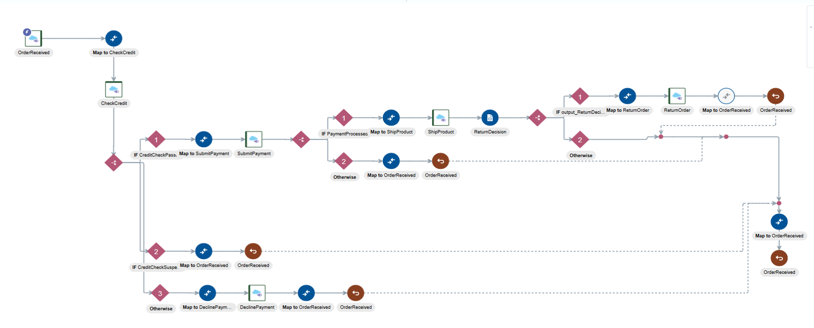

# Lab 300: Online Shopping Integration Development

## Introduction

In this Lab we are going to take a sample integration flow and add additional components to finish the flow.

The AIC integration flow that we'll be building is shown in the following picture:


---

```
You have now completed Lab 300 of the AIC Developer Workshop. In the next lab, we are going to create a User Interface using ABCS, then call the REST API with online shopping request.

- This Lab is now completed.