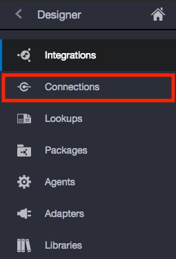
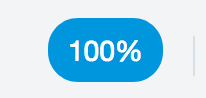
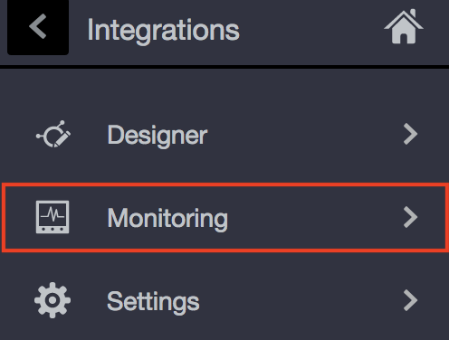
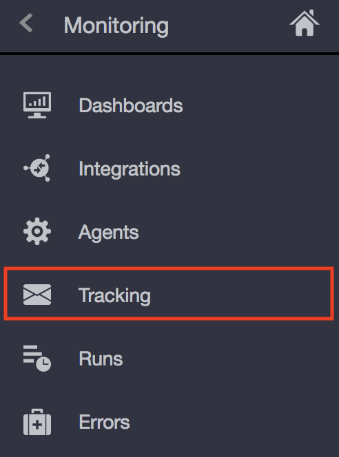

# **Lab 300 - Part A: Oracle Integration Cloud (OIC) Development Workshop**
## Online Shopping Integration Pre-Development

## **Objectives**

- To configure the environment with the starter files that were given to you by your instructor

- To understand the full flow of the integration prior to building the conditional branches in Lab 300B

## **Introduction**

- Before we dive in and create the integration, we want you to get an understanding of the flow and the end result you are working to obtain from the integration flow. This lab will walk you through uploading the integration artifacts and testing the flow in Postman, and API testing tool.

---

## **Getting Started**

This lab will walk you through the necessary set-up needed to complete the subsequent labs.

### **Pre-Requisites**
> - Lab 000 Should be complete prior to starting this lab
>  
> **For this lab you will need access to the following:**
> 1. Access to a provisioned OIC instance
> 2. ONLINE_SHOPPING_APP_01.00.0000.iar
> 3. ONLINE_SHOPPING_APP_FULFILLM_01.00.0000.iar
> 4. ONLINESHOPPINGAPPPAYMENTVALIDATI_01.00.0000.iar
> 5. Note taking app or text editor (Notepad or Word Document)

## **300a.1: Gain Access to the Oracle Integration Cloud Home Page and Nagivate to the Integration Designer Page**

**300a.1.1**: Navigate to the Home Page by using the OIC URL provided to you by your instructor. The URL should have the following pattern: 
https://{**InstanceName**}-{**CloudAccountName**}.integration.ocp.oraclecloud.com/ic/home/

**300a.1.2**: Log in using the IDCS re-route page

  

**300a.1.3**: From the home page, select *Integrations* and you should be auto redirected to the Integration Designer Page where you will see a list of the all the integrations available on the environment.

## **300a.2: Begin Configuration By Uploading the .iar Files**
   
**300a.2.1**: Select *import* 

**300a.2.2**: Select *Choose File* and find one of the three *.iar* files for this lab and repeat until all three files are uploaded

**300a.2.3**: Once uploaded, your integration cloud should appear as pictured below:

**300a.2.4**: Now, navigate to the connections page by clicking on *Connections* in the Designer Menu

**300a.2.5**:  When you upload .iar files, the connections used in the integration are automatically pre-populated. We will just need to click into and configure each

## **300a.3: Configure the Connections (Triggers Only)**

**300a.3.1**: First we need to configure the connections labeled ***Trigger*** 
> - OnlineShoppingAppService  
> - Online Shopping Fulfillment

**300a.3.2**: Click on the connection name to open the connection details

**300a.3.3**: Select *Test*. Once prompted with success and you see 100%, select, *Save*, and *Close*. Complete this for both connections and you will see the pencil icons update to checkmarks. 

## **300a.4: Activate the First Two Integrations**

**300a.4.1**: Navigate back to the Integrations Page by selecting *Integrations* from the Designer Menu  

**300a.4.2**: Select the sliding icon to *Activate* the integration for ***Online Shopping App Payment Validation*** and you will be prompted with a modal window. In this window, check the boxes to **"Enable tracing"** and **"Include payload"**  

**300a.4.3**: Repeat this process for the ***Online Shopping App Fulfillment*** Integration until your integration list resembles the image below. 

> **Note: Do Not Activate the Third Integration yet**

**300a.4.4**: For both activated integrations individually, click on the gear icon   and copy/ paste the endpoint URL in your preferred note taking application

## **300a.5: Configure the Remaining Connections (Invokes)**

**300a.5.1**: Navigate back to the connections page by clicking on *Connections* in the Designer Menu

**300a.5.2**: Configure the Connections labeled ***Invoke***

> - Online Shopping PAYMENT Invoke
> - Online Shopping FULFILLMENT Invoke

**300a.5.3**: Let's start by configuring the Payment Invoke. Click on the connection name to open the details.

**300a.5.4**: Configure Connection Properties by:
> 1. Changing the connection type to *REST API Base URL*
> 2. Changing the TLS Version to *TLSv1.2*

> 3. Pasting in the respective URL from your note application in the *Connection URL*

**300a.5.5**: Configure Security by providing your connection with a username and password that can access this OIC endpoint

**300a.5.6**: Once Completed, Select *Test*. Once prompted with success and you see 100%, select, *Save*, and *Close*. Complete this for both connections and you will see the pencil icons update to checkmarks. 

**300a.5.7**: Now, Let's configure the **Fulfillment** Invoke. Click on the connection name to open the details.

**300a.5.8**: Configure Connection Properties by:
> 1. Changing the connection type to *REST API Base URL*
> 2. Changing the TLS Version to *TLSv1.2*

> 3. Pasting in the respective URL from your note application in the *Connection URL*

**300a.5.9**: Configure Security by providing your connection with a username and password that can access this OIC endpoint

**300a.5.10**: Once Completed, Select *Test*. Once prompted with success and you see 100%, select, *Save*, and *Close*. Complete this for both connections and you will see the pencil icons update to checkmarks. 
Completed Connection

**300a.5.10**: All connections should be completed at this point and we can navigate back to the Integrations Page to activate our last integration.

## **300a.6: Activate the Online Shopping App Integration**

**300a.6.1**: Navigate back to the Integrations Page by selecting *Integrations* from the Designer Menu  

**300a.6.2**: Select the sliding icon to *Activate* the integration for ***Online Shopping App **

**300a.6.3**: Check the boxes to **"Enable tracing"** and **"Include payload"** then select *Activate*

## **300a.7: Test the Integration**

**300a.7.1**: Once activated, click on the gear icon   and click on the Endpoint URL.

**300a.7.2**: A New tab will open with documentation. Copy the Endpoint URL listed here that ends in "/orders" and navigate over to Postman

**300a.7.3**: In Postman, 
> 1. **Paste the URL** in the bar inside the builder window. 
> 2. Change the verb to **POST**
> 3. Add Authorization details 

> 4. Navigate back to your browser with the documentation and copy the Request Sample JSON into the body window. **Make sure to select the *raw* radio button and change the frop down from text to *JSON (application/json)***

> 5. You should receive a response of "ORDER_PROCESSED"

> If for some reason, you received a different response, please check your formatting, HTTP Method/VERB and URL, before asking your instructor for assistance.

**300a.7.4**: Navigate back to the browser and go to Integration Monitoring page to see the tracing and to help you understand the flow

 -->
 --> 

--- 

# **THIS LAB IS NOW COMPLETED. PLEASE SEE YOUR INSTRUCTOR FOR FURTHER INSTRUCTIONS**