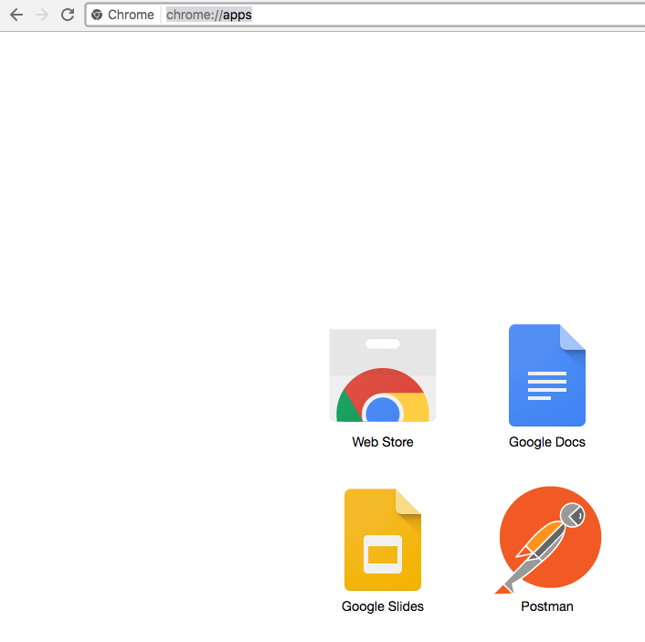

# **Lab 300 - Part B: Oracle Integration Cloud (OIC) Development Workshop**
## Online Shopping Integration Development

## **Introduction**

In this Lab, we will be using Oracle Integration Cloud (OIC) to add additional components to finish the flow of a sample integration.

The integration flow that we will be working to build is depicted below:


---
## **Objectives**
- Complete the sample integration by adding two conditional branches to the flow

### **Pre-Requisites**
- This lab assumes that you have already completed [Lab300A](/ics300a.md)

## **Required Artifacts**

- The following lab 
- An Oracle Cloud account (supplied by your instructor)

---

## **300b.1: Login to your Oracle Cloud account**

>***NOTE:*** the **User Name** and **Password** values will be given to you by your instructor. See _Lab 100 **1.1.1**: Login to your Oracle Cloud Account_ for more information on how to sign into the OIC home page

**300b.1.1**: Navigate to the Home Page by using the OIC URL provided to you by your instructor. The URL should have the following pattern: 
https://{**InstanceName**}-{**CloudAccountName**}.integration.ocp.oraclecloud.com/ic/home/

**300b.1.2**: Log in using the IDCS re-route page

  

**300b.1.3**: From the home page, select *Integrations* and you should be auto redirected to the Integration Designer Page where you will see a list of the all the integrations available on the environment.


## **300b.2: Clone and Develop your Integration**

**300b.2.1** Using the existing integration named **Online Shopping Sample**, create a clone integration 

**300b.2.2** Search with above integration name as shown below 


**300b.2.3** Select the hamburger icon the right and Click **Clone** as shown below 


**300b.2.4** A new page comes up.Provide the integration name as per your choice ,description if you wish to and Click **Clone** button as shown in the below diagram


**300b.2.5** A new integration is created as shown below 


_Now we will add two conditional branches in the same flow and test it out_

**300b.2.6** Click on the newly selected integration and you will see already an exsting workflow.Here we will add two conditional branches and test it out.


**300b.2.7** Select **switch button** on left and click **+** as shown below 


**300b.2.8** A new branch will be created as shown below in below diagram 


**300b.2.9** Click on the edit button as shown below


**300b.2.10** A new page comes up,provide **Expression Name**  as shown below 


**300b.2.11** Next we need to select the input paramater.Drill down and select **response** field and drop on empty box as shown below


**300b.2.12** Finally provide the expression parameter as shown below and click on **Validate** button.Your overall page should look like this 


**300b.2.13** Click **Close** button to come out of this wizard. Next we need to map the output parameters. Select **Map** Data from Actions tab as shown 


**300b.2.14** Drag **Map Data** and place in swimlane as shown below


**300b.2.15** Select Map data and click on 'Edit' button as shown below


**300b.2.16** Mapper page will appear. Expand the response mapper as shown below.


**300b.2.17** Update the response mapper with below mentioned field. Click on validate to finish the setup.


**300b.2.18** Now go back to Main page and click on **Actions** Tab this time.Select **Return** Item as shown below


**300b.2.19** Next drag and drop selected item on the same swimlane. Since we are already set up map previously (1.14), delete the newly appered one.


Your overall setup should look like this.This completes our one - **if else** logic


**300b.2.20** Next go to the **Invoke** tab and select **REST** connector - `OnlineShoppingPaymentInvoke` as shown below 


**300b.2.21** Drag and drop connector to **Otherwise** swimlane as shown below


**300b.2.22** A new page will come up. Provide the below details as marked in red. Once done, click **Next**.


**300b.2.23** Here we need to add two input fields for request mapping. Click on **+** button and add  parameters as shown below.Click **Next** once done.


**300b.2.24** This is section where we need to select Response mapping. Select **JSON Sample** and click **Inline** section as marked in red


**300b.2.25** A blank textbox opens up.Enter a Sample Jason as shown below.Click **OK** once done.


**300b.2.26** Click **Next**


**300b.2.27** This is final step of adapter configuration.Check all the parameters and click **Done** to exit from here.


**300b.2.28** Now we are back to Integration page.Here you will see two new Items as shown


**300b.2.29** Click on **Edit** button for the mapper file as shown 


**300b.2.30** A new page opens up.Update the PaymentAction field with expression value as shown. Also map **OrderId** from source with target.Once done Next Click  **Validate** to verify all the parameters.Finally select **Close** to exit from this page. 


**300b.2.31** Now we are back to the Inegration Page,from here select **Return** action item as shown


**300b.2.32** Drag and drop to the same swimlane,your entire message flow should look like this


**300b.2.33** Next click on **Edit** button for response mapping as shown


**300b.2.34** A new mapper page shows up.Update the response parameters and Click **Validate** to update the same.Once done click **Close** to exit the same.


**300b.2.35** Click on **Save** and then **Close** to exit the integration design canvas


You should see your _New_ integration in list of _Integrations_


**300b.2.36** Click on the switch next to your integration to activate


**300b.2.37** On the **Activate Integration ?** popup window, select **Enable Tracing**, then **Include payload**, then click on **Activate**


**300b.2.38** Once your integration is activated, select Cogwheel type of button (1.) and select the given url.


**300b.2.39** You will be redirected to a new page. Coppy Endpoint URL and save it for later. You are going to use it in Postman for testing your request.


### 300b.3: Testing your Integrations

Testing the activated integration can be done using multiple tools and depends on your preference. See each relevant product's website on how to install the tool, if its required.

**300b.3.1** Got to URL **chrome:/apps** in _Chrome_ and open POSTMAN



**300b.3.2** Click on the Collection tab as shown below  


Provide the name for your collection as it shown below


Click on the AddRequest tab as shown below


**300b.3.3** Here provide the name of the Integration and optional description and click **Save**


**300b.3.4**A new page comes up.Click on **Authorization Tab**. For Authorization type, select Basic Auth. Provode the credentials that you used to sign in to Oracle Cloud.


**300b.3.5** Next we need to set the request. 1. Select POST method and copy paste the Endpoint URL that you saved earlier (from 1.39). 2. Click on **Body** section and update the request json as shown below 

```json
{"OrderId": "1235", "UnitPrice": "10000", "NumberOfItems": "3", "ShippingState": "OH", "Model": "WalkeyTalkey 1.0", "ReturnReason": "Does Not Work"}
```

Make sure you select JSAN(applicatiom/json) format (5)


**300b.3.6** Click on Send Button and check the response at bottom.


**300b.3.7** Now go back to the Integration Page  and navigate **Tracking** field as shown below 


**300b.3.8** Click on the order instances as shown


**300b.3.9** You will see the overall flow of the integration as shown 


--- 

# **THIS LAB IS NOW COMPLETED**
> In the next lab, we are going to create a User Interface using Visual Builder Cloud Service (VBCS), then call the REST API with online shopping request.