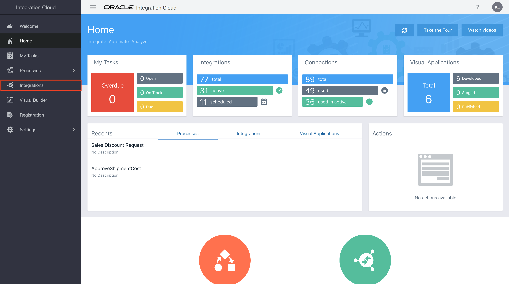

# **Lab 400: Add VBCS Screen to Trigger REST API**
## **Introduction**

In this Lab we are going to create a User Interface using ABCS, then call the REST API with online shopping request.
## **Objectives**
- 

### **Pre-Requisites**
- **REQUIRED:** 
    - This lab assumes that you have already completed [Lab300B](/ics300b.md)

## **Required Artifacts**

- The following lab 
- An Oracle Cloud account (supplied by your instructor)

## **Getting Started**
---

## **400.1: Login to your Oracle Cloud account**

**400.1.1:** Navigate to the Home Page by using the OIC URL provided to you by your instructor. The URL should have the following pattern: 
https://{**InstanceName**}-{**CloudAccountName**}.integration.ocp.oraclecloud.com/ic/home/

**400.1.2:** Log in using the IDCS re-route page

  

**400.1.3:** From the home page, select *`Integrations`* and you should be auto redirected to the Integration Designer Page where you will see a list of the all the integrations available on the environment

## **400.2:**

--- 

# **THIS LAB IS NOW COMPLETED**
> In the next lab, we will use AIC Process Automation capability to implement a Business Process that will be triggered for suspended orders from online shopping API call