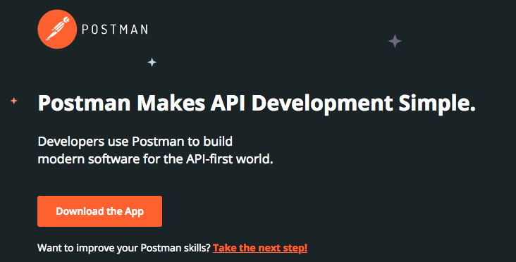
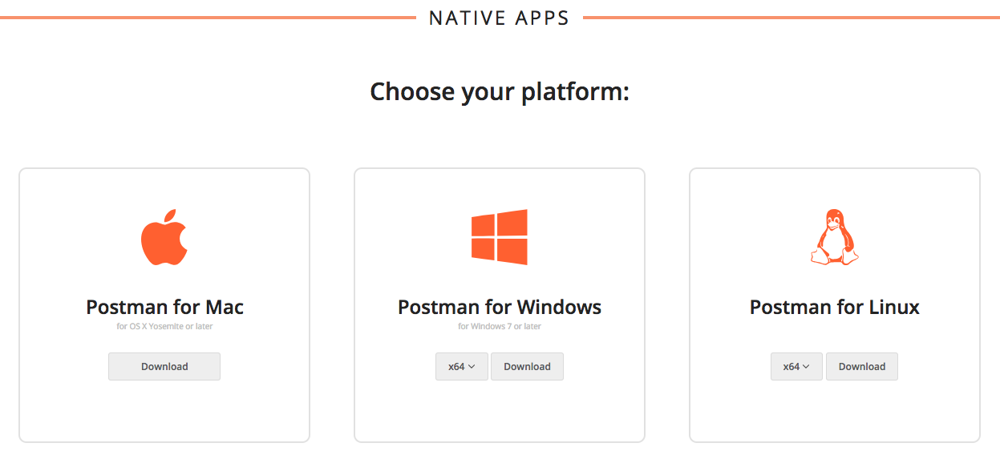

#  **Lab 000: Oracle Integration Cloud (OIC) Development Workshop** 

> ***Last Updated: February 2019***

## **Software Pre-Requisites**
* For this lab, we will provide you with the resources you will need to complete subsequent labs

    **You will need access to the following:**

    1. Internet Connection
    2. Web Browser
    3. API Testing Tool
    4. Oracle Cloud Account with Integration Instance Provisioned
    5. Text Editor Application OR Note Taking Application

---

## **Recommended Web Browser**
Although most modern browsers are supported, we recommend using *Firefox or Chrome*. As of the last update of this lab, Visual Builder Cloud Service (VBCS) which is used in later labs best functions using Chrome.  
>If you are having issues with either browser, please clear your cookies or work in private browsing/incognito mode

- [Download Chrome](https://www.google.com/chrome/)  
- [Download Firefox](https://www.mozilla.org/firefox)

## **Recommended Testing Tools**
You will need an application that will allow you to interact with HTTP APIs.  
Here is a link to an opinion of the [Top 10 API Testing Tools](https://medium.com/@alicealdaine/top-10-api-testing-tools-rest-soap-services-5395cb03cfa9). Please utilize the one that you are most comfortable working with. However, please note we will be using Postman.

### **Install Postman**

To install Postman navigate to their website <https://www.getpostman.com> and follow their instructions on [Getting Started.](https://learning.getpostman.com/getting-started/)

 > Take a moment to familiarize yourself with the interface: [Navigating Postman](https://learning.getpostman.com/docs/postman/launching_postman/navigating_postman)

## **Recommended Text Editors and Note Taking Applications**
- Default note application on your machine
- Notepad++
- Notes (on Mac) 
- Sticky Notes Application
- Atom
- Sublime

## **Additional Resources**
 > [What is an API?](https://www.google.com/search?q=what%27s+an+api&spell=1&sa=X&ved=0ahUKEwj2v7yA7KLgAhXdFzQIHazAADsQBQgpKAA&biw=1440&bih=798&dpr=2)

 > [What is an API? -- Video](https://youtu.be/IAFN2UzN784)

 > [Oracle My Services Log In](https://cloud.oracle.com/en_US/sign-in)

--- 

# **THIS LAB IS NOW COMPLETED. PLEASE SEE YOUR INSTRUCTOR FOR FURTHER INSTRUCTIONS**
> In the next lab, you will explore the different functionalities in OIC [LAB 100](/ics100.md)