# **Lab 400 - Add Visual Builder Cloud Service (VBCS) Web Application to Call OIC REST API**

## **Introduction**

This is the fourth of several labs that are part of the **OIC Development** workshop.

In this lab, you will create a VBCS Web Application which calls the REST end-point created in the previous Lab 300.

The image below depicts the completed VBCS Web Application UI:

  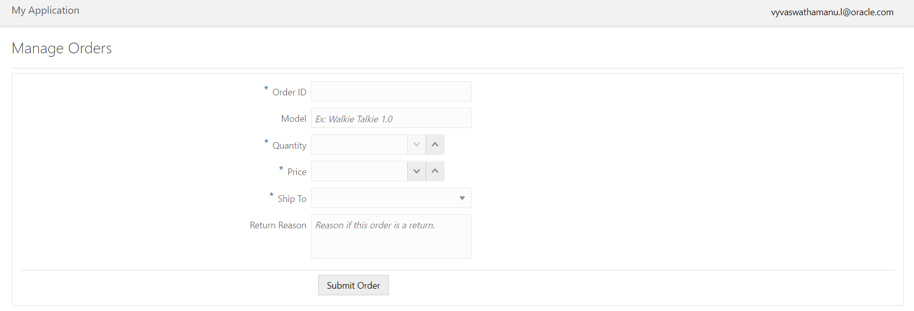

This web application will use a form to call a REST service (post/orders). The form will submit an order and has required validations for fields (mandatory, number range, etc). Also, a custom validation for the entire form before submitting it (using a button) will be built. The order status is returned to the web application.

## **Objectives**

- Learn how to create a VBCS web application
- Learn how to create form validations, business objects and modify source code
- Learn to change design views and use live mode to create/test data
- Learn how to write custom form validations

## **Pre-Requisites**
- **REQUIRED:** 
    - This lab assumes that you have already completed [Lab 300B](/oic 300b.md)

## **Required Artifacts**

- The following lab 
- An Oracle Integration Cloud account (supplied by your instructor)

# **Getting Started**

## **400.1: Login to the Oracle Cloud Account and VBCS**

**400.1.1:** Navigate to the Home Page by using the OIC URL provided to you by your instructor. The URL should have the following pattern: 
https://{**InstanceName**}-{**CloudAccountName**}.integration.ocp.oraclecloud.com/ic/home/

**400.1.2:** Log in using the IDCS re-route page

  

**400.1.3:** From the home page, select *`Integrations`* and you should be auto redirected to the Integration Designer Page where you will see a list of the all the integrations available on the environment

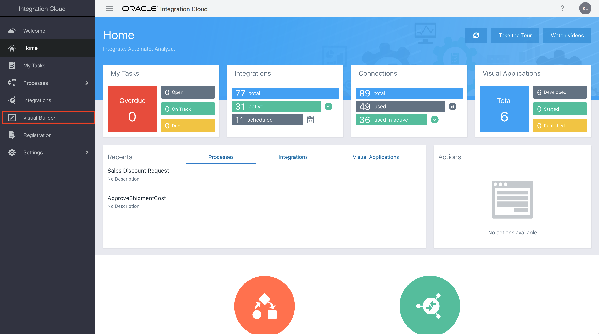

- The Visual Builder console should appear as below

  

## **400.2: Create a VBCS Application**

**400.2.1:** Click **`New`** to create a new Visual Application

  

**400.2.2:** 
- Enter Online_Shopping followed by your initials in the first field ***Application Name***
  - For example - ***Online_Shopping_XX*** where ***XX*** is the first letter of your first and last name
- Click **`Finish`** to continue

  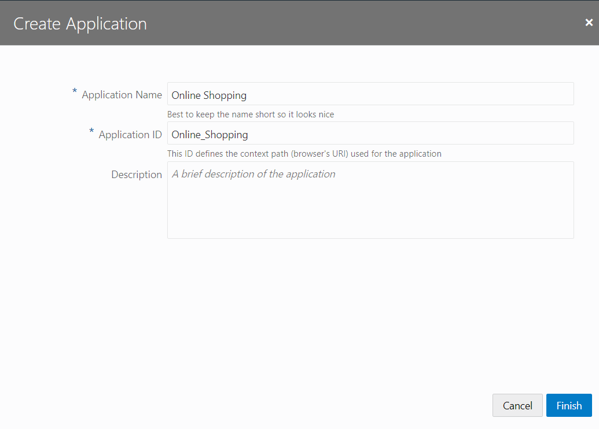
  
- You will be redirected to the application dashboard as seen below
  - Check out the various options that can be done using Visual Builder Cloud, **Mobile Apps, Web Apps, Service Connections, etc.**

  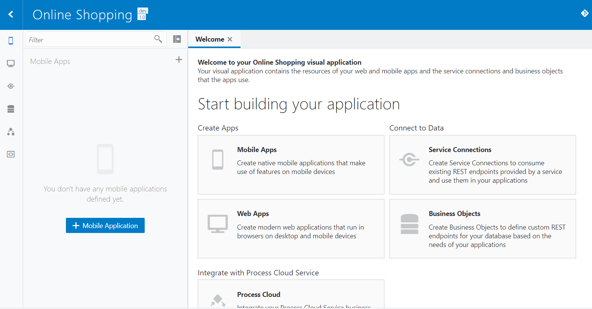

## **400.3: Create a Service Connection**

**400.3.1:**
- Create a service connection (REST) to our service built in Lab 300 by clicking on **`Service Connections`** under *Connect to Data* on the Welcome tab then by clicking the **`+ Service Connection`** button on the left

  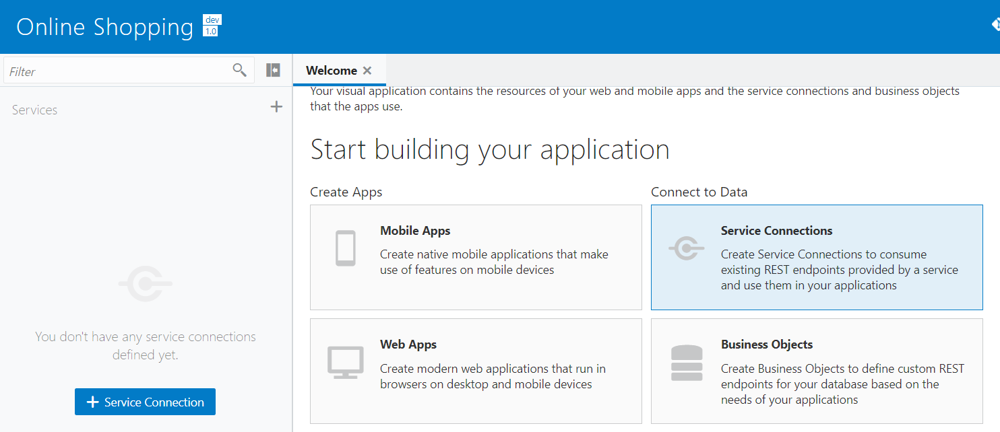

**400.3.2:** You will be redirected to the configuration page where you will select **`Define by Endpoint`**

  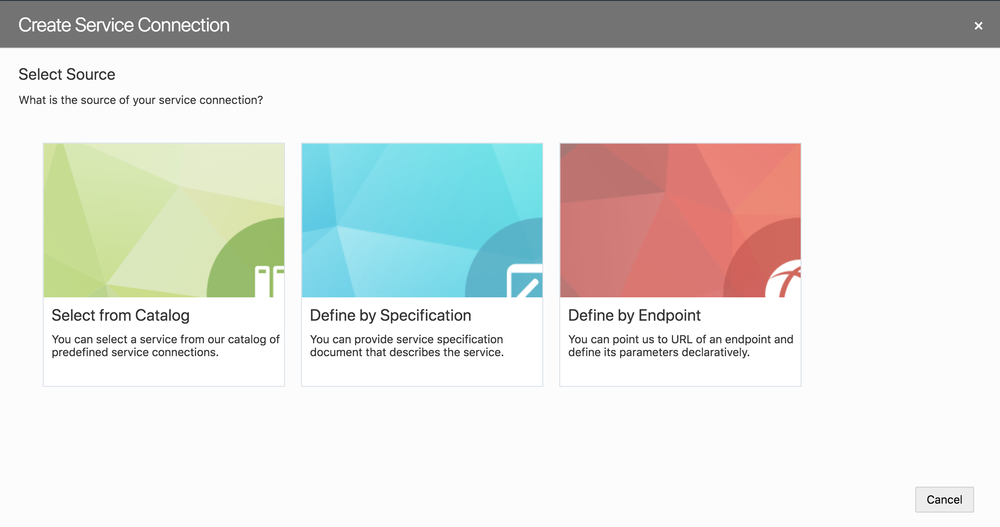

**400.3.3:** On the next page, select the **Method** as **`POST`**, enter the REST endpoint **URL** generated at the end of the previous lab and click **`Next`**

  

**400.3.4:** On the next page, enter the **Service Name** as _OnlineShoppingICS_ under the **Service** tab

  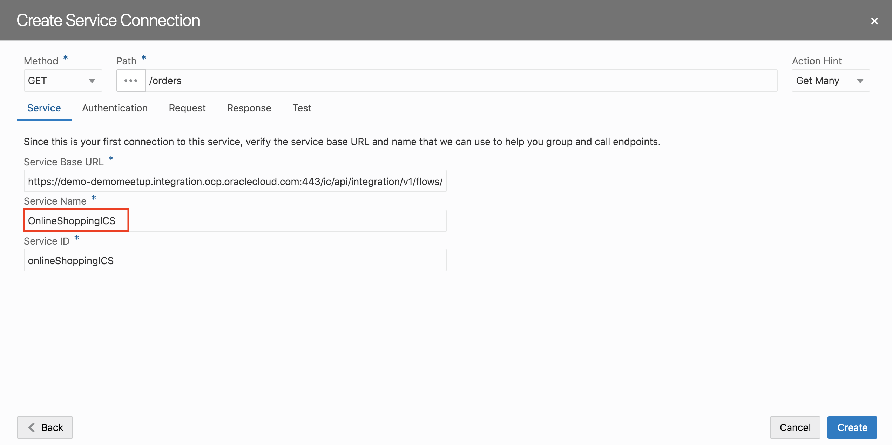

**400.3.5:** Click on the **Authentication** tab, select **Basic** as the *Authentication Mechanism* and enter the **Username** and **Password** used to sign in that was given to you by your instructor

  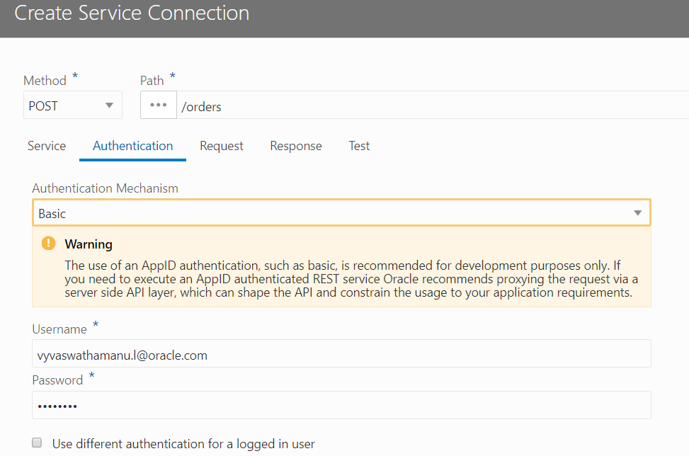

**400.3.6:**  On the ***Request*** tab, select the **Media Type** as **application/json** and enter the sample payload below

  ```json
    { "OrderId":"1234", "UnitPrice":"10000", "NumberOfItems":"3", "ShippingState":"OH", "Model":"WalkeyTalkey 1.0", "ReturnReason":"Does Not Work" }
  ```

  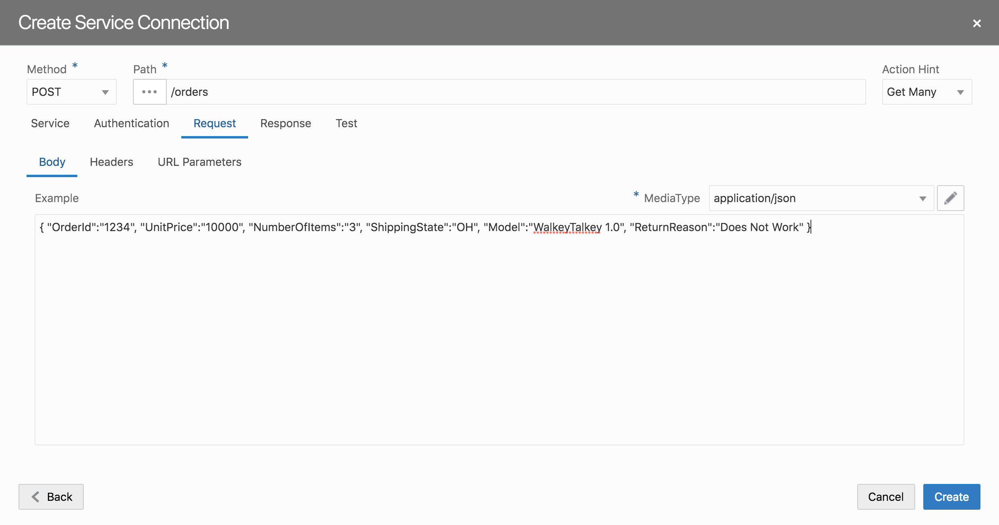

**400.3.7:**  On the ***Response*** tab, select the **Media Type** as **application/json** and enter the sample payload below

  ```json
    {"response":"ORDER_SUCCESSFUL"}
  ```

  

**400.3.8:** Test the service connection to see if the REST service returns a response
- On the **`Test`** tab, click the **`Send`** button
  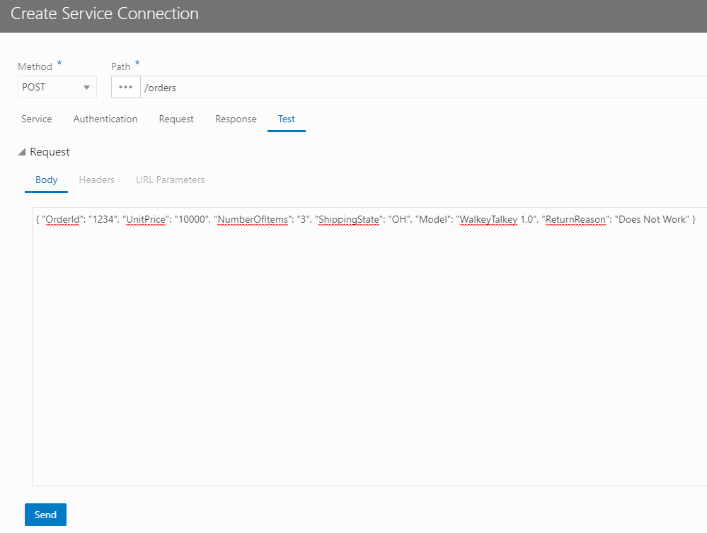

- Scroll down to verify that the REST call is successful
  - An HTTP **200 OK** status is sent back along with a response payload

  
  
- Click **`Create`** and continue to creating a web application

  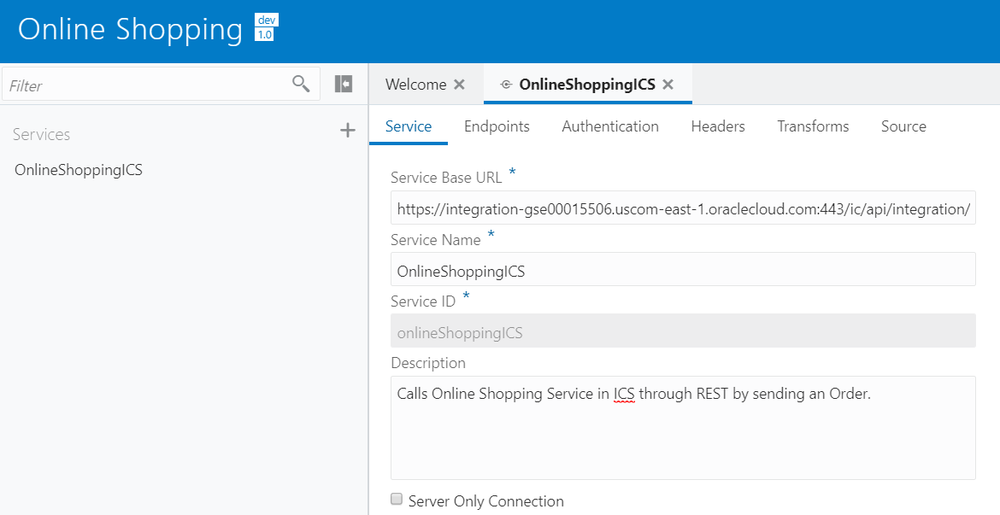

## **400.4: Create a Web Application**

**400.4.1:** On the *Welcome* tab, Click on **`Web Apps`** and then click on **`+ Web Application`** on the left

  

**400.4.2:** Enter the application **Id** as *ShoppingPortal* followed by your initials 
  - For example - ***ShoppingPortal_XX*** where ***XX*** is the first letter of your first and last name
- Click **`Create`** to continue

  

- Take a moment to review the various designs views, tools, components, etc available in the application console

  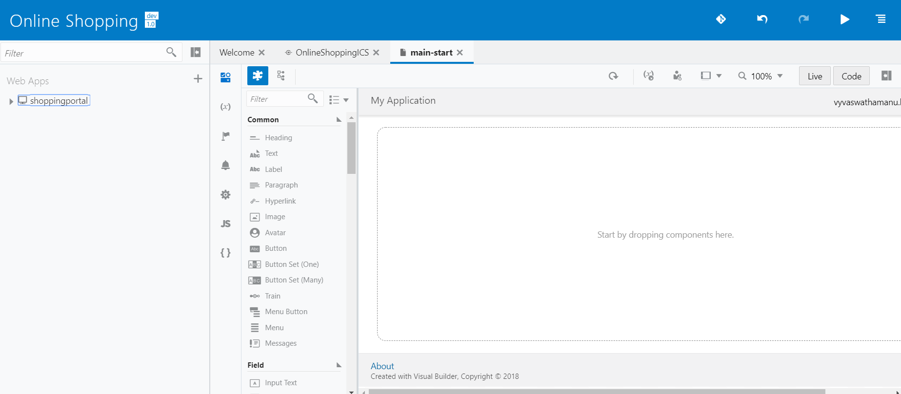

- You can switch between design views as shown below

  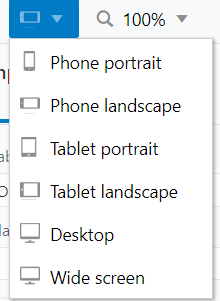

**400.4.3:** To create a web form drag and drop components from the *Common* palette on the left. The form will hold the fields required to create/process an order 
- Drag and drop a **Heading** component
> **Note: You can also filter components in the search bar to find a component quickly**

  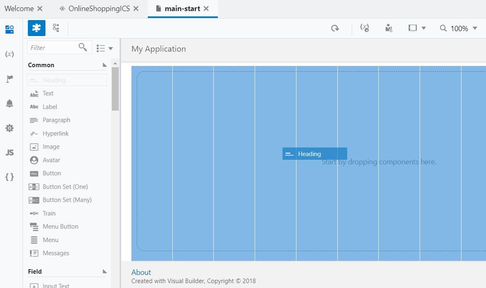

**400.4.4:** Click on the property tab, highlighted below and enter `Manage Orders` in the **Text** field  then make the heading **Level** **`H2`**

  

**400.4.5:** Drag and drop a **Horizontal Rule** *Layout Component* under the heading then a **Panel** *Layout Component* under the Horizontal Rule

  

  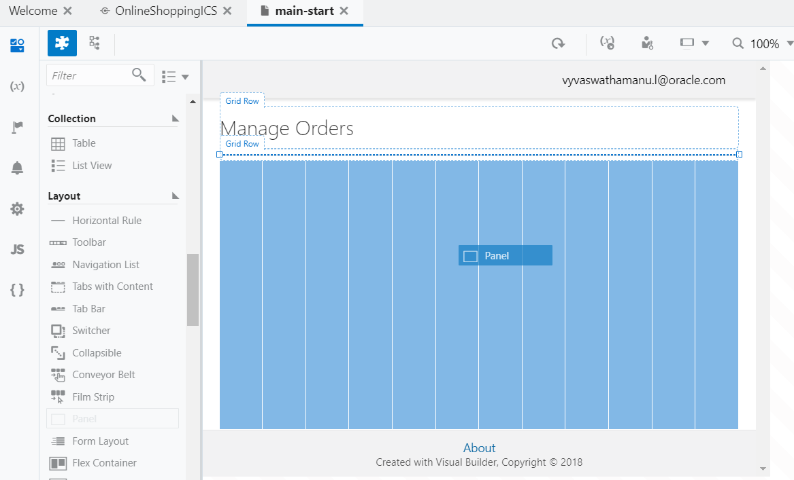

**400.4.6a:** Drag and drop a **Form Layout** Component inside the **Panel** to create our form components

  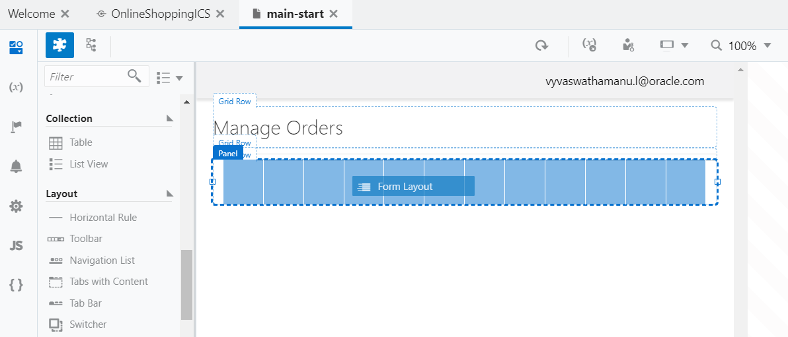

**400.4.6b:** Edit the form properties 
- Set **Max Columns** to **1**   

**AND**
- Set **Label Edge** to **Start**

  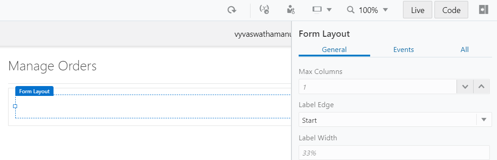

**400.4.7a:** Drag and drop an **Input Text** component inside the **Form Layout**

  

**400.4.7b:** Set the properties of the **Input Text** 
- Name **Label Hint** as *Order ID* and selecting the checkbox for **Required**
  - Selecting **Required** will make the form field mandatory marked by an asterisk (**_*_**)

  

**400.4.8a:** Drag and drop a **Number** component below Order ID within the same elements
  > **Note**: The drop position is below the **Input Text** and inside the **Form Layout**. The editor highlights the drop position in blue

  

**400.4.8b:** Edit the following properties:
  
  > **Label Hint**: `Quantity (1 - 10)`  
  > **Min**: `1`  
  > **Max**: `10`  
  > **Required**: `Checked`  

  

 > **Note:** We have set the **Min** and **Max** properties, and this will be validated at runtime

**400.4.9a:** Drag and drop a **Currency** _Field component_ below the number component. Again, note the drop position

  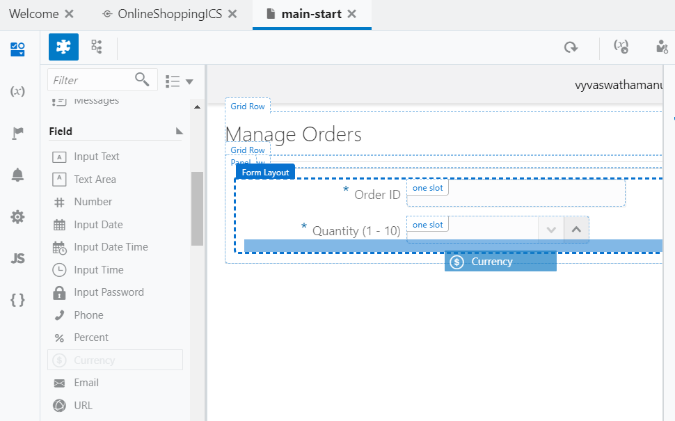

**400.4.9b:** Set the following _General_  properties:

  > **Label Hint**: `Price`  
  > **Min**: `0`  
  > **Max**: `1000`  
  > **Step**: `100`  
  > **Required**: `Checked`  
  > **Converter**: `$`  
  > **Currency Code**: `USD`  
  > **Currecy Display**: `Symbol`  
  > **Currency Format**: `Standard`  
  > **Minimum Integer Digits**: `1`  
  > **Minimum Fraction Digits**: `0`  
  > **Maximum Fraction Digits**: `2`  
  > **Thousands Separator**: `Checked`

  

  

**400.4.10:** Drag and drop a **Select One** _Field component_ below the currency component
- Set the **Label Hint** as *Ship To* 
- Select the checkbox for **Required**

  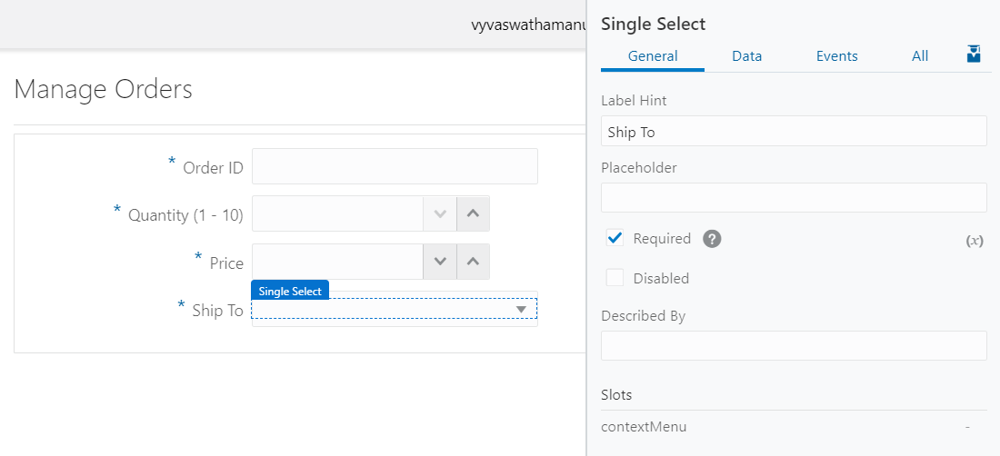
 
**400.4.11:** Drag and drop another **Input Text** _Field component_ inbetween Order ID and Quantity.
- Set the **Label Hint** to _Model_ 
- Set **Placeholder** to _Ex: Walkie Talkie 1.0_

  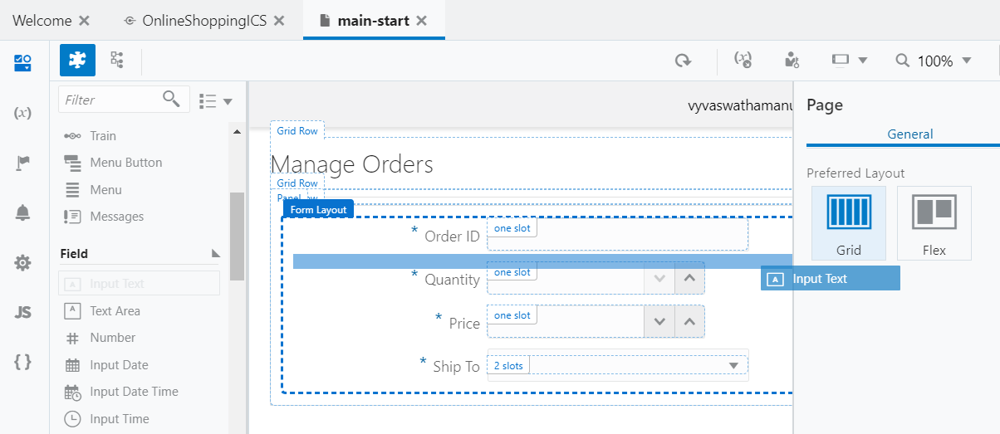

  

**400.4.12:** Drag and drop a **Text Area** _Field component_ below the select one component
- Set the **Label Hint** to `Return Reason`  
- **Placeholder** as `Reason if this order is a return.`   
- Set **Rows** to `3`  

  

  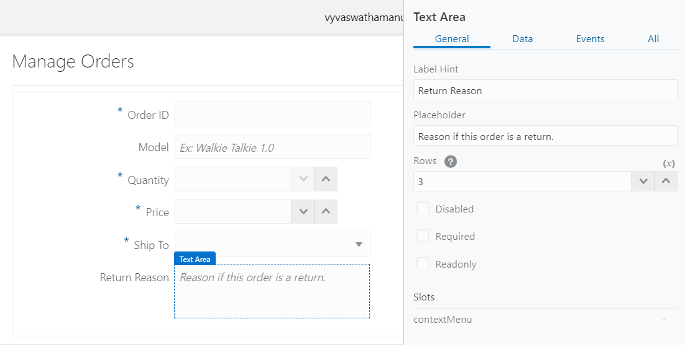

**400.4.13:** Take a look at your form in real-time by clicking on the `Play Button` on the top right corner to ***Run***  

  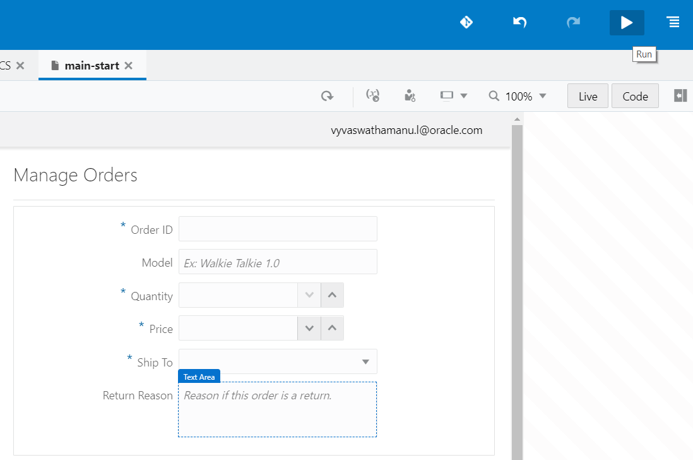

> The UI form should resemble as depicted below: 

  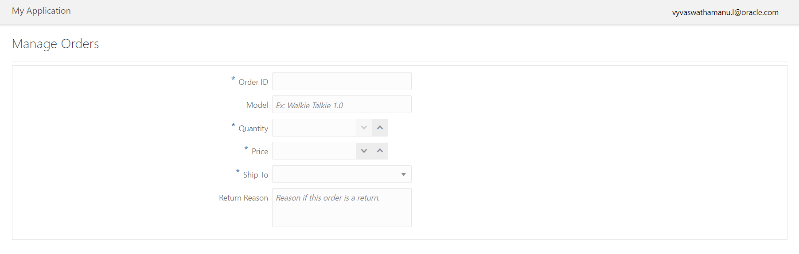

## **400.5: Create a Business Object**

> Now you will create a business object to hold the "Ship To" locations and later on bind it to the **Select One** component created in the previous section

**400.5.1:** Click on the business objects icon on the left-most icon pane and click **`+ Business Object`**

  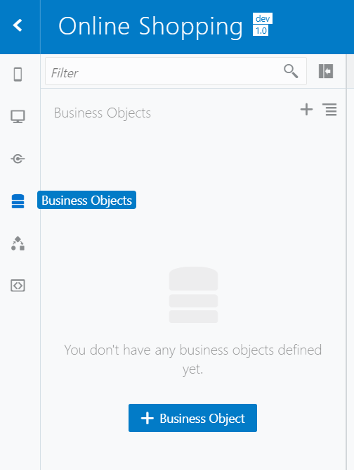

**400.5.2:** Enter the **Label** as ***ShipToLocationLOV*** and click the checkmark icon to create a business object

  

**400.5.3:** Review the various tabs available in the created business object
- Starting with the **Fields** tab, see that a few default fields have already been created along with the business object

  

- Add a new field to hold the states for _Ship To_ location, click on **`+ New Field`**
- Set the **Label** as *State* and type as **String** with the *A* icon
- Click the checkmark to create a new field 

  

**400.5.4a:** Add a few rows to the business object inside the **Data** tab. Click on **`+ Add Row`**

  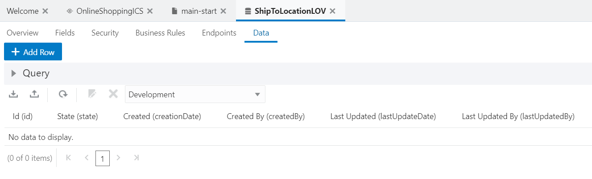

- Enter the **State** as _AK_ and click the checkmark icon. A row is created and the ID is auto-populated

  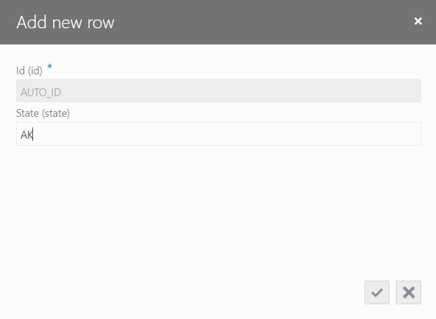

  

**400.5.4b:** Let's explore another method to upload data through a CSV file.
- Click [states csv](/files/states.csv) to use the states.csv file
  - The contents should resemble as seen below:

  ```javascript
    State
    CO
    DE
    FL
    GA
    HI
    IL
    KS
    LA
    MO
  ```

- Click on the import icon 
- Upload the `states.csv` file
- Select the **Append** option
- Click on **Import**.

  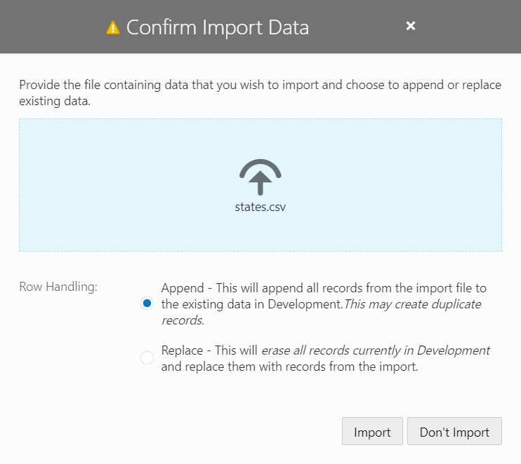

- Check the status and make sure the status shows green checkmarks
- Click **`OK`** to continue

  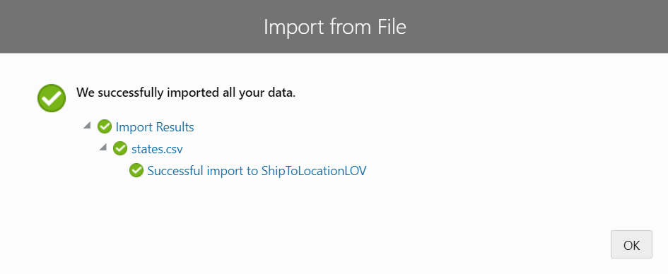

**400.5.5:** Verify that all the rows from the csv are updated and the existing row created (with ID 1) is not overwritten

  

## **400.6: Bind Data-Bound Components to Business Objects and Create Variables to Hold Form Fields**

**400.6.1:** Back in our UI design view
- Select the _Ship To_ **Single Select**
- Open the properties and click on the human icon

  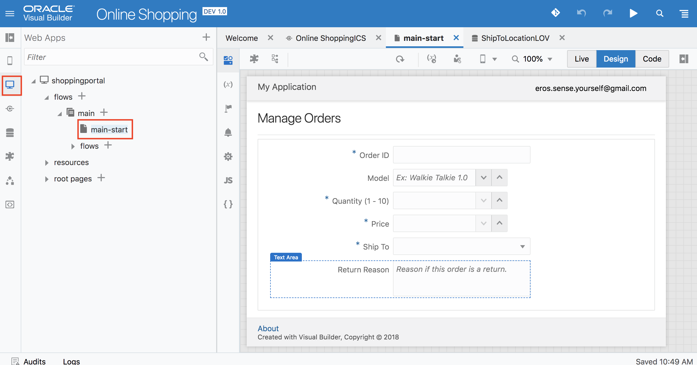

  

**400.6.2a:** Click on **`Add Options`** to open the configuration wizard

- Expand and select the **GET** endpoint of the **Business Object** (ShipToLocationLOV) just created
- Click **Next** to continue

  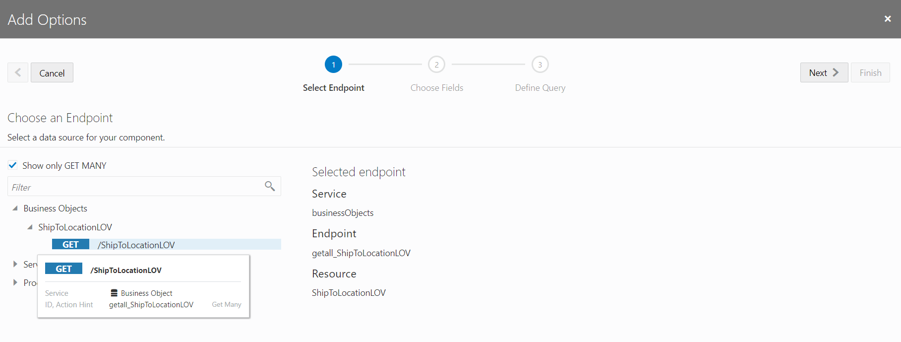

**400.6.2b:** Check **state** on the left hand side under `response/items/item[i]` and select **state** for **Value**. And for **Label** drag and drop  **state** on the field bellow. Click **Next**

  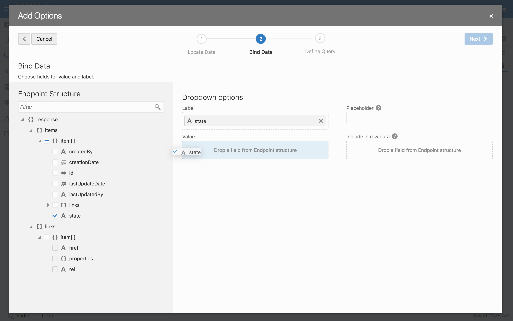

**400.6.2c:**  Leave defaults since there are no query parameters for this object and click **Finish**

  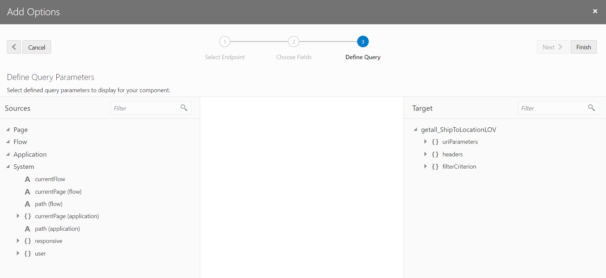

**400.6.2d:**  Check that the **Options** property under **Data** tab in the properties of the **Single Select** is updated as `[[$page.variables.shipToLocationLOVListServiceDataProvider]]` to point to ShipToLocationLOV

  

**400.6.3:**  
- Switch to **`Live`** mode by clicking on the button with the same label 
- You're testing if the data is really being populated from ShipToLocationLOV. You'll see that the _Ship To_ shows the options from the business object ShipToLocationLOV

  

**400.6.4:**  Switch to the source code view by clicking on **`Code`**. This view is automatically generated while we are designing the UI using the visual drag and drop approach

  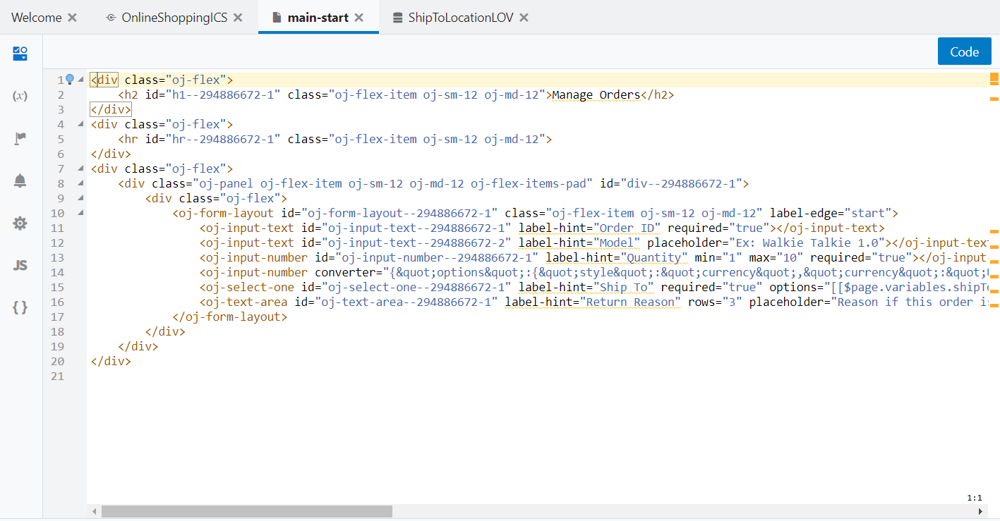

**400.6.5a:** Click on **`Design`** to return to the main environment. Then, drag and drop a **Horizontal Rule** after the **Form Layout** under the **Panel**

  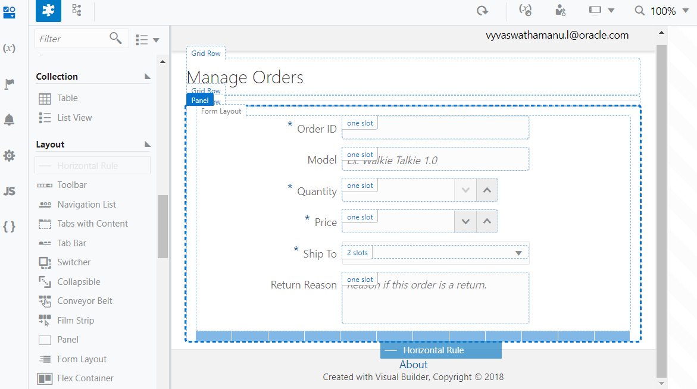

**400.6.5b:** 
- Drag and drop a **Button** after the **Horizontal Rule** under the **Panel**
> The area where the **Button** would be placed would be highlighted in a darker shade of blue as illustrated below

  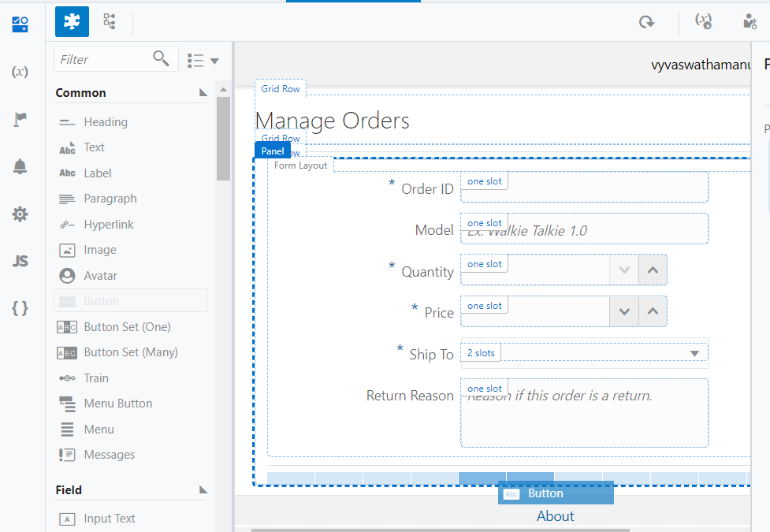

**400.6.5c:** Change the **Text** property of the button to `Submit Order`

  

**400.6.6a:** Create the required data types and variables to hold and submit data now. 
- Click on the variables icon highlighted below 
- Click the **`Types`** tab
- Click **`+ Type`** and select **`From Endpoint`** in the dropdown

  

**400.6.6b:** 
- Expand **Service Connections** 
- Select the **`POST /orders`** service from the sub-element listed
- Click **Next** to continue

  

**400.6.6c:** On the _Type_ Configuration page:
- Name it `postOrders`
- Select **Request** under **Endpoint Structure** 
- Click **Finish** to return to the variable page

  

**400.6.7a:** Click **`+ Type`** and select **`From Endpoint`** again to create another variable of response type

  

**400.6.7b:** On the _Type_ Configuration page:
- Name it `postOrdersResponse`
- Select **Response** under **Endpoint Structure** 
- Click **Finish** to return to the variable page

  

  

**400.6.7b:** Add variables to hold the data for all the form fields
- Click the **`Variables`** tab 
- Click **`+ Variable`**

  

**400.6.7c:** 
- Name the variable `orderInfo`
- Select the type as **postOrders**
- Click **Create**

  

**400.6.8a:**  Verify that the variable is created and click **`+ Variable`** to create another variable

  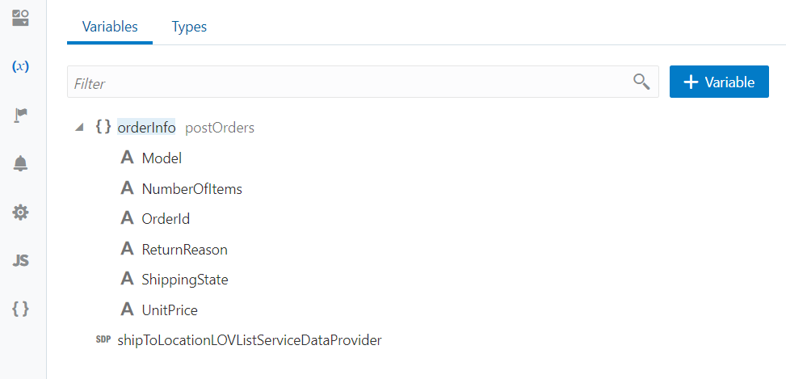

**400.6.8b:**
- Name the variable `reponseCode`
- Select the type as **postOrdersResponse**
- Click **Create**

  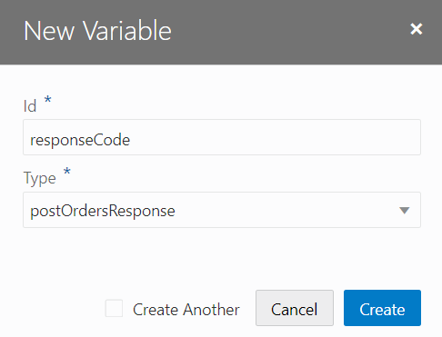

**400.6.8c:** Click **`+ Variable`** to create another variable
- Name the variable `orderID`
- Select the type as **String**
- Check the box for **Create Another**
- Click **Create**

  

**400.6.9:** Repeat step ***400.6.8c*** to create the following variables:

  - `model`  
  - `returnReason`    
  - `shipTo` of type **String**  
  - `price`    
  - `quantity` of type **Number**

  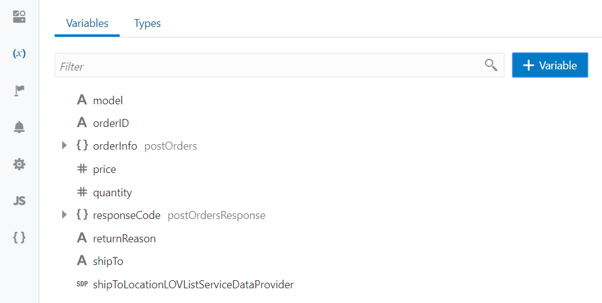
  
**400.6.10:** Return to the design view:
- Select **Order ID**
- Click on the **Data** tab inside the property window

  

**400.6.11:** Open expression builder icon and select **orderID** as the **Value** for the **Input Text**
> **NOTE:** You may need to click the reload icon if the variables created fail to appear under the expression builder

  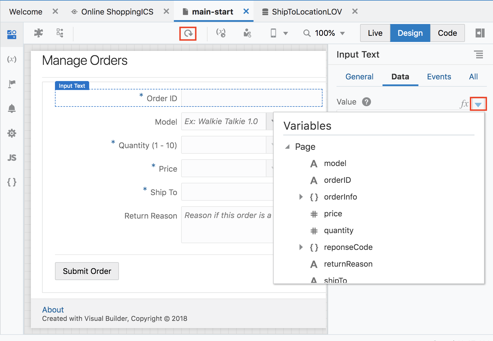

**400.6.12:** Verify that the **Value** is updated to `{{ $page.variables.orderID }}`

  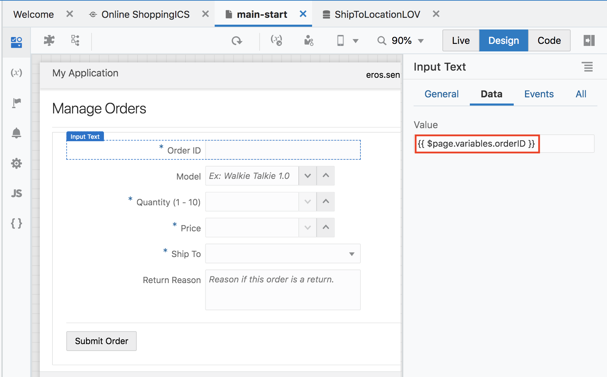

**400.6.13:** Repeat step ***400.6.12*** for all the form fields and verify the **Value** is as follows:

  > **Model:** `{{ $page.variables.model }}`  
  > **Quantity:** `{{ $page.variables.quantity }}`  
  > **Price:** `{{ $page.variables.price }}`  
  > **Ship To:** `{{ $page.variables.shipTo }}`  
  > **Return Reason:** `{{ $page.variables.returnReason }}`

## **400.7: Map Fields and Variables to Call the REST Endpoint**

**400.7.1a:** 
- Click on the **Button** element to open the property inspector
- Click **`+ New Event`** 
- Select **`Quick Start: 'click'`**
  - This means that an **Action Chain** will be triggered when the button is clicked

  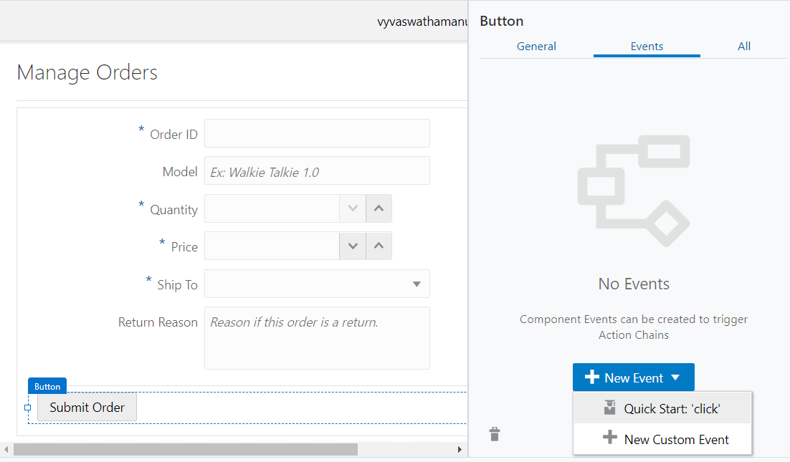

**400.7.1b:**  Design the **Action Chain** to submit the form on button click
- Drag and drop an **Assign Variables** action onto the flow below **Start** onto the **`+`** icon

  

**400.7.1c:** In the property inspector, click on the **Assign** link to assign and map variables

  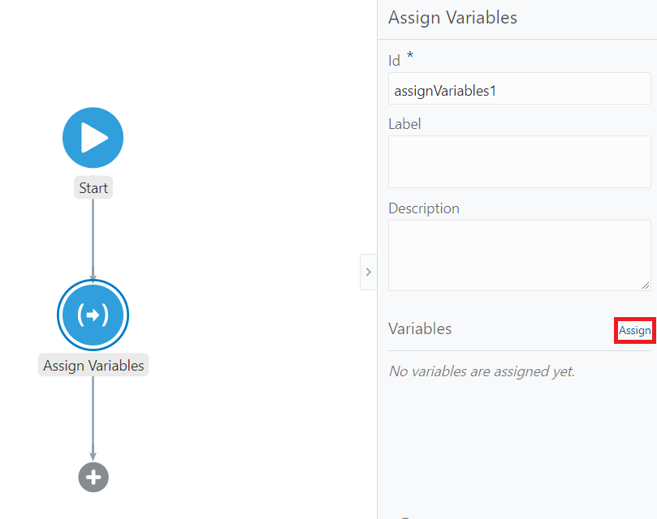

**400.7.2a:** 
- Click on `model` under **Page** variables on the left-hand side
- Drag and drop it to `Model` under `orderInfo`

  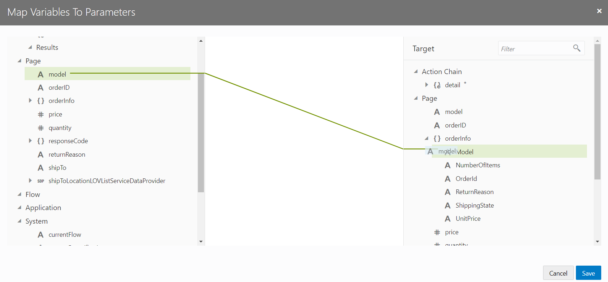

**400.7.2b:**  Repeat the actions from step _400.7.2a_ to map the following fields and click ***`Save`***

  > - `orderID` ---> `orderInfo/OrderId`  
  > - `quantity` ---> `orderInfo/NumberOfItems`  
  > - `price` ---> `orderInfo/UnitPrice`  
  > - `shipTo` ---> `orderInfo/ShippingState`  
  > - `returnReason` ---> `orderInfo/ReturnReason`  

  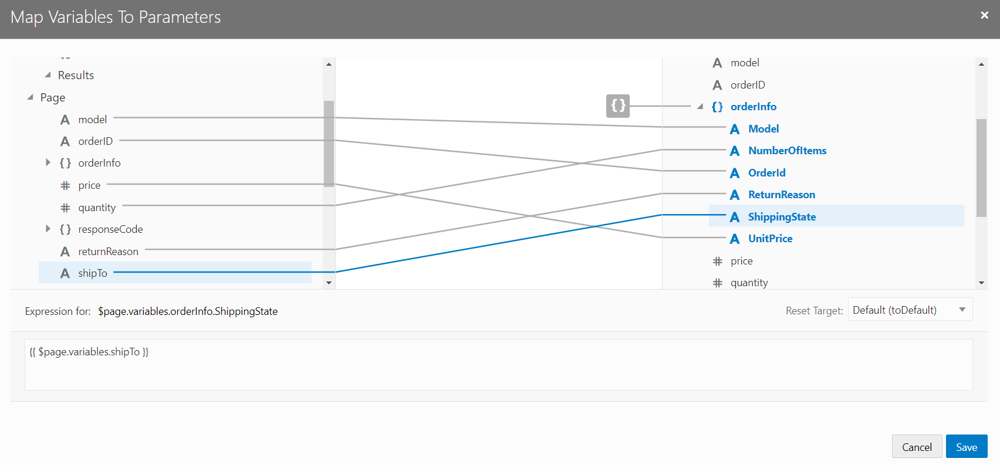

<!-- - Check that the `orderInfo` variable is mapped under **Variables**.  -->
**400.7.3:** Drag and drop a **Call REST Endpoint** unto the **`+`** icon under the assign

  

**400.7.4:** 
- Click on **Select Endpoint**
- Expand **Service Connections** and select the **POST** service from **OnlineShoppingICS**
- Click **Select**

  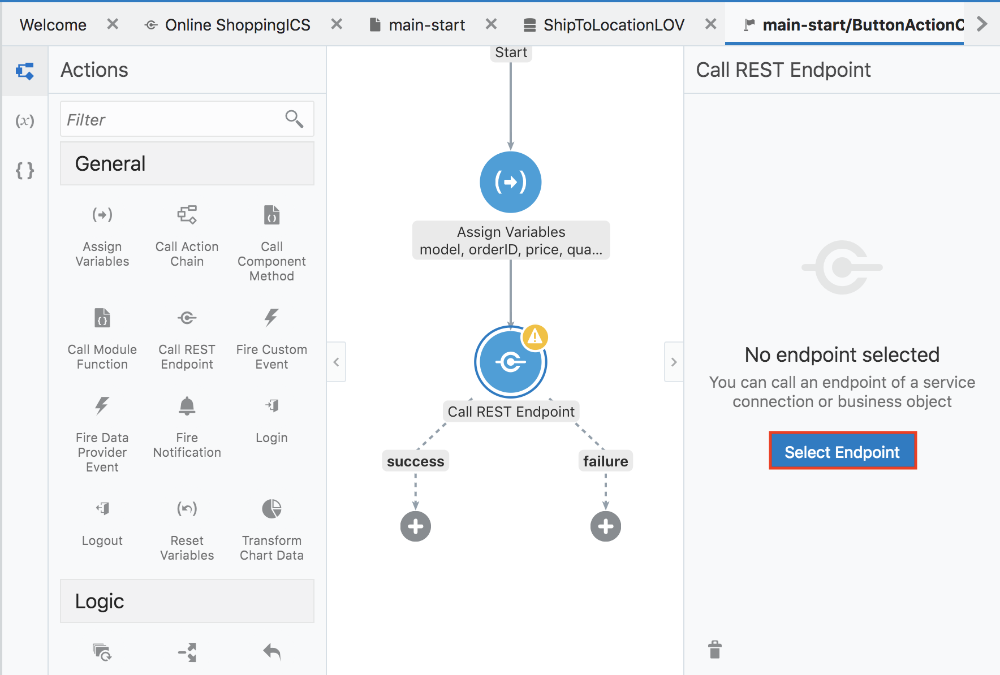

  

**400.7.5:** Notice that the parameters are in the **NOT MAPPED** status
- Click on the **Assign** link to assign the parameters

  

**400.7.6a:** 
- Map the `orderInfo` on the left-hand side under **Page** variables to `body` on the right-hand side under **Parameters**

  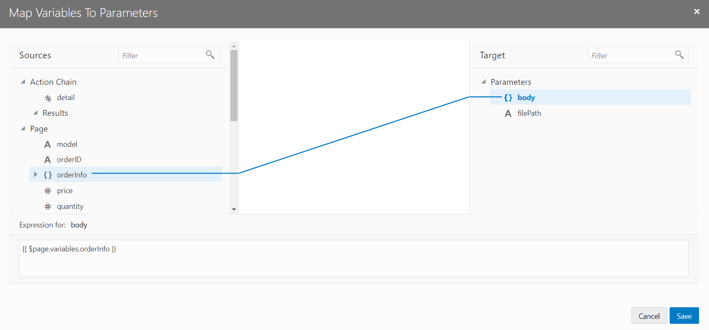

**400.7.6b:**
- Add another **Assign** to assign the return value from the REST service call
  - Drop it on the **`+`** icon next to the **Call Rest Endpoint** -- ***NOT BELOW IT*** --

  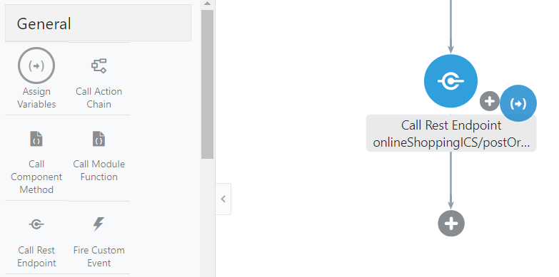

**400.7.6c:**
- Drag another **Assign** on the left side **`+`** icon below **Call Rest Endpoint**

  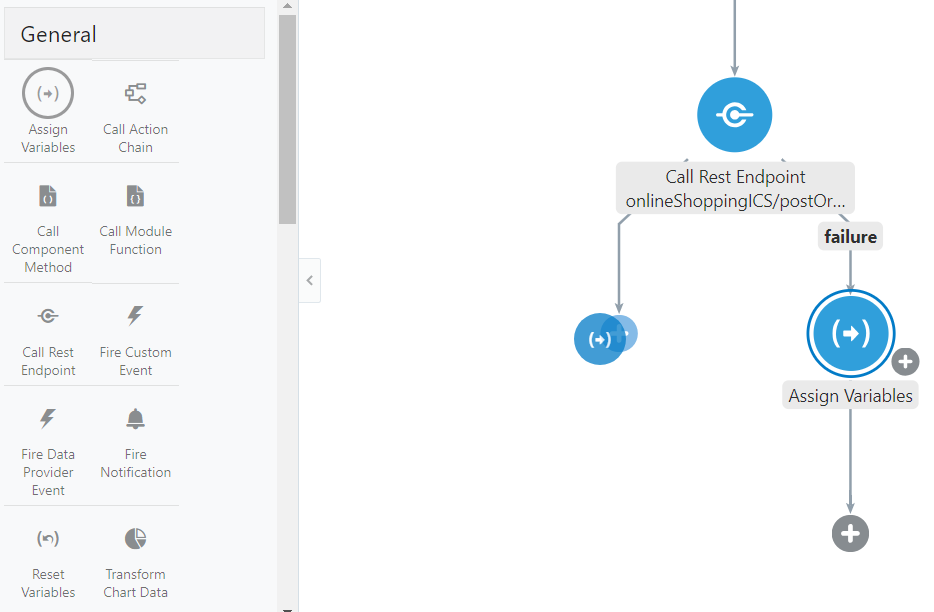

**400.7.7a:** Assign the return values from the REST call
- Click on the **Assign** under `success`
- Click the **Assign** link beside **Variables**

  

**400.7.7b:**
- Drag and drop the `response` element under **Results** on the left to `responseCode/response` on the right under **Page** variables

  

**400.7.7c:**
- Repeat steps **400.7.7a** for the **Assign** under `failure`
- Instead of dragging and dropping an element, paste the following snippet for the **Page** variable `responseCode` on the right:
  
  ```javascript
    {
    "response": "Failure"
    }
  ```

  

- The final **Action Chain** should resemble as depicted below:

  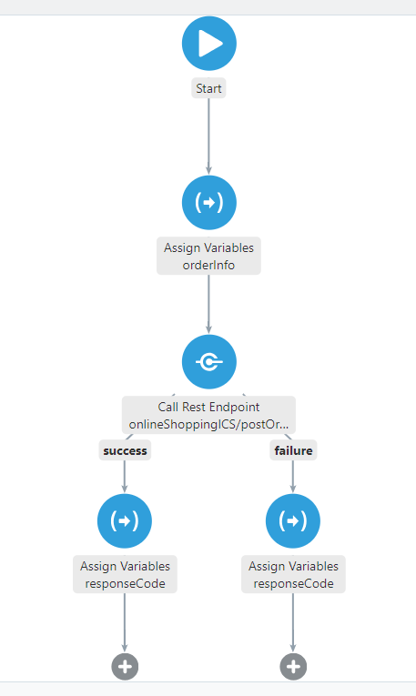

## **400.8: Test the Web Application**

**400.8.1:** Return to the **Design** view

**400.8.2:** We can test the application in **Live** mode by clicking the _LIVE_ icon  or by clicking the Play Button  (**Run** icon) on the top right corner which opens the form in a new browser window

> - To test the application, we need to capture the response and display it somewhere so that we know what is happening behind the scenes (whether the REST endpoint was called, whether the call was successful or the call failed)  
>  - We can achieve this simply by using a **Text** component and setting the value of the component to the reponse payload from the web-service call.

**400.8.3:** Drag and drop a **Text** _Field Component_ on the page next to the button
> You can use the **Filter** option to find it quickly

  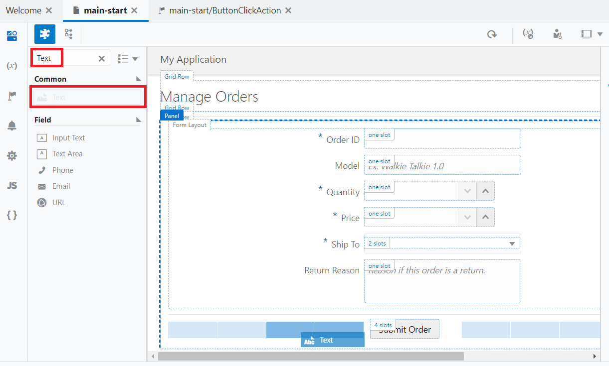

**400.8.4:** 
- Open up the expression builder 
- Set the **Value** property of the **Text** component to `responseCode/response`

  

- Verify that the value is updated to `{{ $page.variables.responseCode.response }}`
- Test the app

  

**400.8.5a:** 
- Play around the form and try entering various values
  - We suggest trying values that you know are incorrect and try leaving values empty values
    - You will be able to see the validations we created on the form fields are at play after tabbing out or after the form field loses focus

> ***NOTE :*** Enter a different **Order ID** every time you click on the **Submit Order** button so that the REST endpoint returns a valid value.

**400.8.5b:** Enter the following data in their respective fields and click on **Submit Order** 

  ```javascript
    Order ID      : 1
    Model         : Test
    Quantity      : 1
    Price         : 1000
    Ship To       : CO
    Return Reason : (Optional - any random text)
  ```

 > ***You can see the web-service (REST) call goes through and a status is returned such as `ORDER_SUSPENDED` or `ORDER_PROCESSED`***

  

**400.8.5c:** Enter the following data in their respective fields and click on **Submit Order**
  ```javascript
    Order ID      : (blank)
    Model         : (blank)
    Quantity      : -100
    Price         : 100000
    Ship To       : (not selected/blank)
    Return Reason : (Optional - any random text)
  ```
  > ***You can see the web-service (REST) call goes through but no status is returned; the form validation is at play and the status of `Failure` that we set in the **Action Chain** is used and printed on the UI this time***

  

  > In the next section, you will alter the flow so that the form is submitted only when all the form fields are validated

## **400.9: Add Client-Side Validation to the Form**

- First we have to set up our form to check the validity of its contents before submitting. We do this by surrounding the form with an _`<oj-validation-group>`_ element, adding a custom isFormValid Javascript function that returns a boolean, and then calling that function before submitting the form.

**400.9.1:** Click on the **Code** button and view the source code that has been generated

  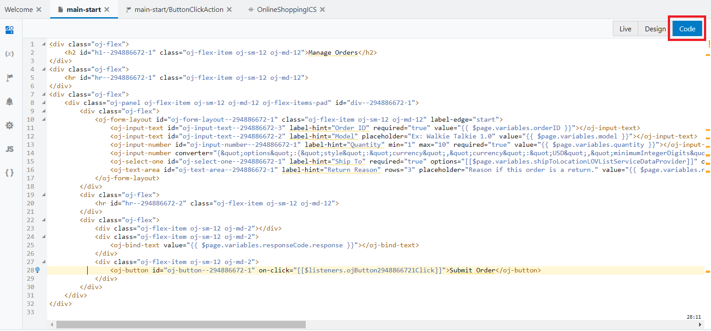

**400.9.2:** Surround the form **div** with `<oj-validation-group id="orderForm">`
> ***Don't forget the closing tag***

  

> ***NOTE:*** The page won't load because we haven't imported the `oj-validation-group` component. Switch to another translation of the **Code** by selecting the icon with the curly braces _`{ }`_

  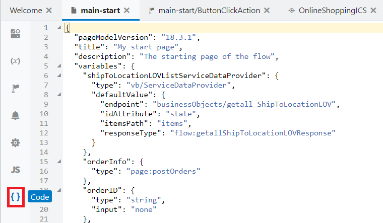

**400.9.3:** Add the following highlighted section to the bottom of the imports section:
> ***NOTE:*** That since this is a JSON object, a **`,`** (comma) needs to be added to the line above
 
  ```javascript
    "oj-validation-group": {
        "path": "ojs/ojvalidationgroup"
      }
  ```

  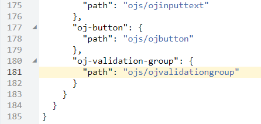
 
**400.9.4:** Click on the `shoppingportal` application on the left and click the **JS** icon to add Javascript. Add the following function:

  ```javascript
    AppModule.prototype.isFormValid = function(form) {
      var tracker = document.getElementById(form); 
      if (tracker.valid === "valid") {
        return true;
      } else {
        tracker.showMessages();
        tracker.focusOn("@firstInvalidShown");
        return false;
        }
    };
  ```

  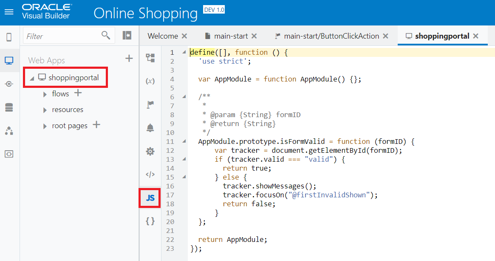

**400.9.5a:**  Change the **Action Chain** on button click
- Click on **Actions** 
- Click on **ButtonClickAction**

  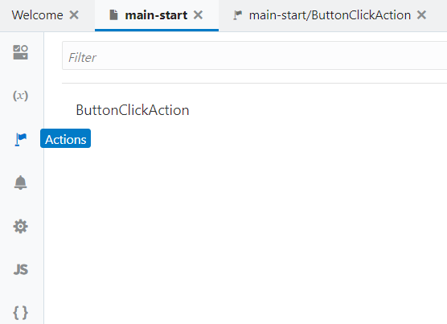

**400.9.5b:** Drag and drop an **If** logic item under **Logic** to the line below **Start**

  

**400.9.5c:** Move the **Assign Variables orderInfo** onto the **`+`** icon under the **true** branch of the **If** logic item

  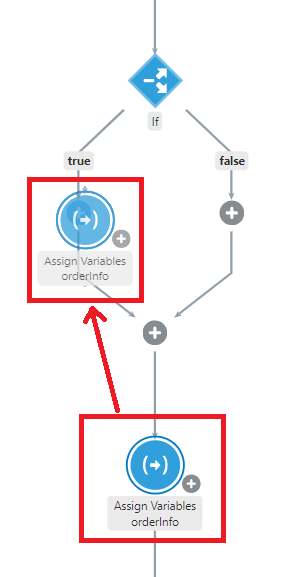

**400.9.5d:** Click on the **If** logic and set the **Condition** property to `{{ $application.functions.isFormValid("orderForm") }}`  
- This will call the form validation Javascript function that we previously wrote

  

- The final **Action Chain** is depicted below:

  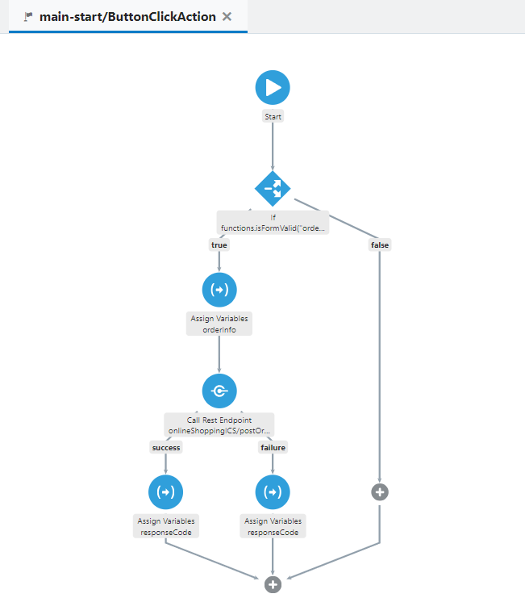

**400.9.6:** 
- Run the form again by clicking the **Run**  icon
- Click the **Submit Order** button without filling in any of the form fields and observe that the form does not get submitted this time and the REST endpoint will not be called

  

**400.9.7:** Fill in the form fields and click **Submit Order** then verify that the REST endpoint is called successfully and a valid status is returned. If not, review the previous steps and try again 

  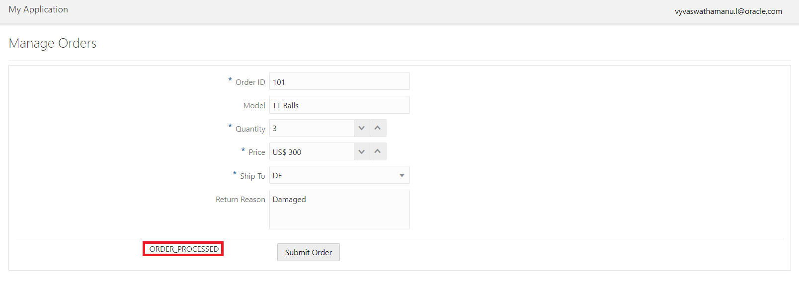

--- 

# **THIS LAB IS NOW COMPLETED**
> In the next lab, we are going to create an approval workflow in Process Automation to process orders  
> [LAB 500](/oic500.md)