# **Lab 600 - Modify the Visual Builder Cloud Service (VBCS) Web Application to Trigger Process Automation Approval Workflow**

## **Introduction**

This is the sixth of several labs that are part of the **OIC Development** workshop. 

In this lab, you will modify the VBCS Web Application created in **Lab 400** and call the approval workflow (created in **Lab 500**). In short, VBCS will invoke an Approval Workflow when a suspended order is returned from from Online Shopping API.

By the end of this lab you will have completed the form based web application which will call a REST service (post/orders) that returns an order status as the response. If the order status is returned as **ORDER_SUSPENDED**, a Process Automation approval workflow will be called to review the order and manually approve or decline the same.

## **Objectives**

- Learn how to call a Process Automation workflow from a VBCS web application

## **Pre-Requisites**
- **REQUIRED:** 
    - This lab assumes that you have already completed Lab 500

## **Required Artifacts**

- The following lab  
- An Oracle Integration Cloud account (supplied by your instructor)

# **Getting Started**

## **600.1: Log In to OIC and VBCS**

**600.1.1:** Navigate to the Home Page by using the OIC URL provided to you by your instructor. The URL should have the following pattern: 
https://{**InstanceName**}-{**CloudAccountName**}.integration.ocp.oraclecloud.com/ic/home/

**600.1.2:** Log in using the IDCS re-route page

  

**600.1.3:** From the home page, select *`Integrations`* and you should be auto redirected to the Integration Designer Page where you will see a list of the all the integrations available on the environment

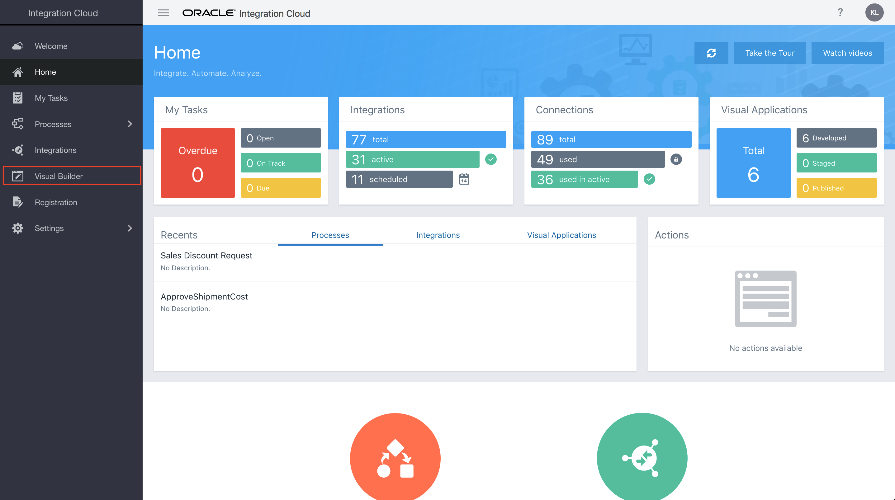

- The Visual Builder console should appear as below

  

## **600.2: Open the VBCS application**

**600.2.1:** Click the application named from Lab 400 to open the Visual Application

  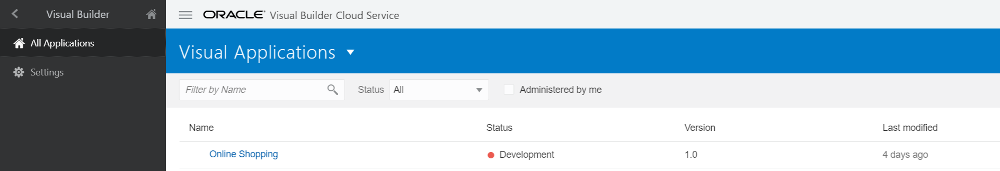

## **600.3: Create a Process Automation Server Connection and Register the Deployed Process**

**600.3.1:** Click on **Process Cloud** on the home page and click on **Process Server** on the left

  

> ***NOTE:*** The process server connection to the Process Automation instance has already been made. 

**600.3.2:** Click on **Test Connection** and check that the connection is successful

**600.3.3:** Click on the **`+`** icon on the left side of **Processes** to register the process that we created in **Lab 500**

  

**600.3.4:** In the window that opens, search for the process (created in Lab 500) by typing a keyword such as `Online` against **Deployed Processes** field

**600.3.5:** 
- Click and select the exact deployed process (note the **Revision** number - this should match the revision version that you deployed during the Lab 500)  
- Give it an alias, for example - `OnlineShoppingProcess AutomationXX` where `XX` are the first letters of your first and last name  
- Click on **Add** to register the process to your VBCS application  
- Close the window by clicking the **`X`** icon on the top right hand corner or using the **Close** button

  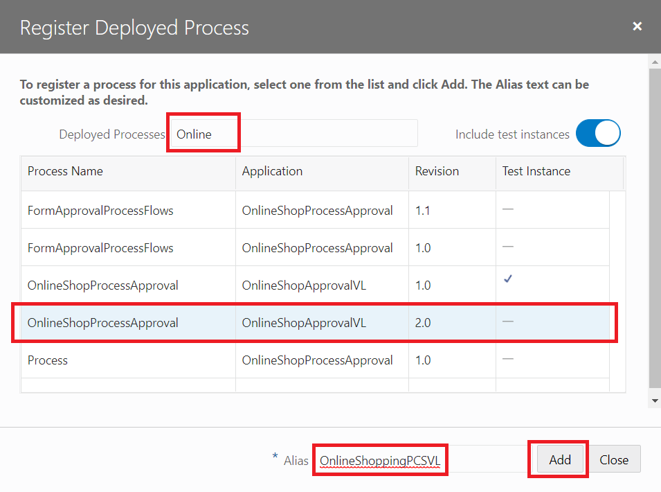

> Note that the process alias is added under the **Process Server** and clicking it will reveal further details about the process on the right

  

## **600.4: Start the Process Automation Process when OIC REST Service Returns a Suspended Order**

**600.4.1:** 
- Click on the web applications icon on the left and select our form by clicking on **main-start** under `shoppingportal/flow/main`. 
- Click on **Actions** (flag icon) and select **ButtonClickAction**

 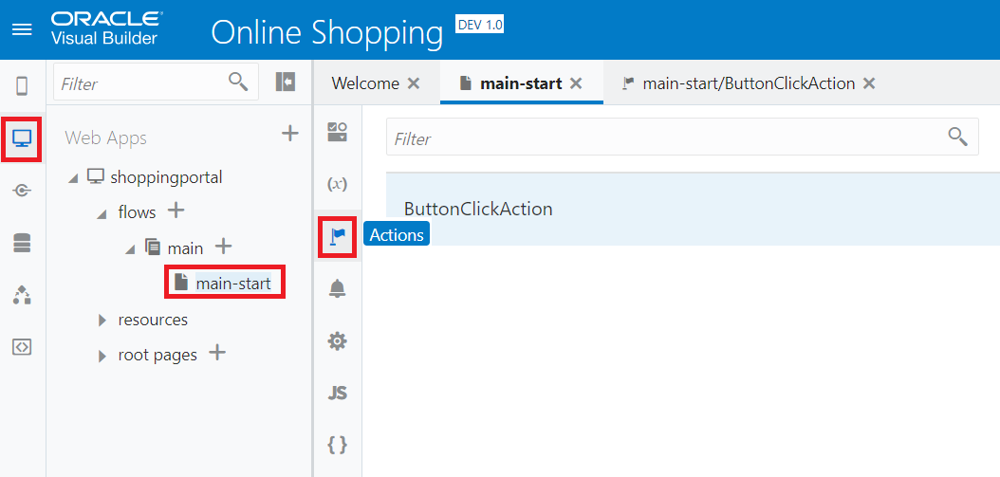

**600.4.2:** Scroll down in the diagram to the end where the REST endpoint is called

  
 
> *We know that a successful REST call results in an `ORDER_PROCESSED` or an `ORDER_SUSPENDED` response. If the order is suspended as returned with an `ORDER_SUSPENDED` response, we will start the Process Automation approval process for manual review and approval. This is coded in the **Assign Variables** of the `success` branch under **Call REST Endpoint***

**600.4.3:** Add an **If** condition below this **Assign Variables** to check if the order is suspended and an `ORDER_SUSPENDED` response was returned by the REST call.

- Drag and drop an **If** under **Logic** to the last **`+`** symbol

  

**600.4.4:** Bring up the expression editor to check for the order suspended condition.
- Click on **`(x)`** and click on **Open Expression Editor** under **Condition**

  

**600.4.5:** 
- In the window that opens, enter `{{ $application.functions.isOrderSuspended() }}` on the blank canvas
- Place the cursor inside `()` 
- Drag and drop the **response** element under `Results/callRestEndpoint1/body` on the left-hand side into `()`

  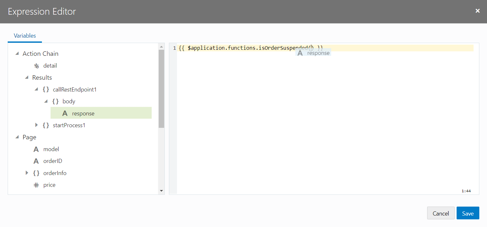

**600.4.6:** Make sure that the condition is updated to `{{ $application.functions.isOrderSuspended($chain.results.callRestEndpoint1.body.response) }}` then click **Save**

  

**600.4.7:** Drag and drop a **Start Process** under **Process** to the **`+`** symbol under the `true` branch of the **If**

  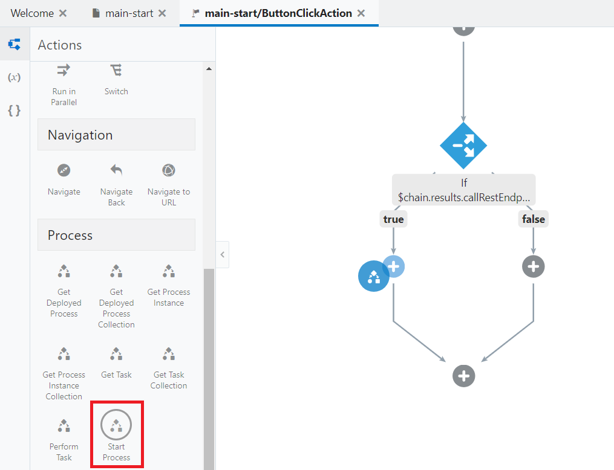
  
**600.4.8a:** Click on **Select Process** on the right

  

**600.4.8b:** Select the **Submit Request** interface under `Process Aliases/OnlineShoppingProcess Automation` and click **Select**

  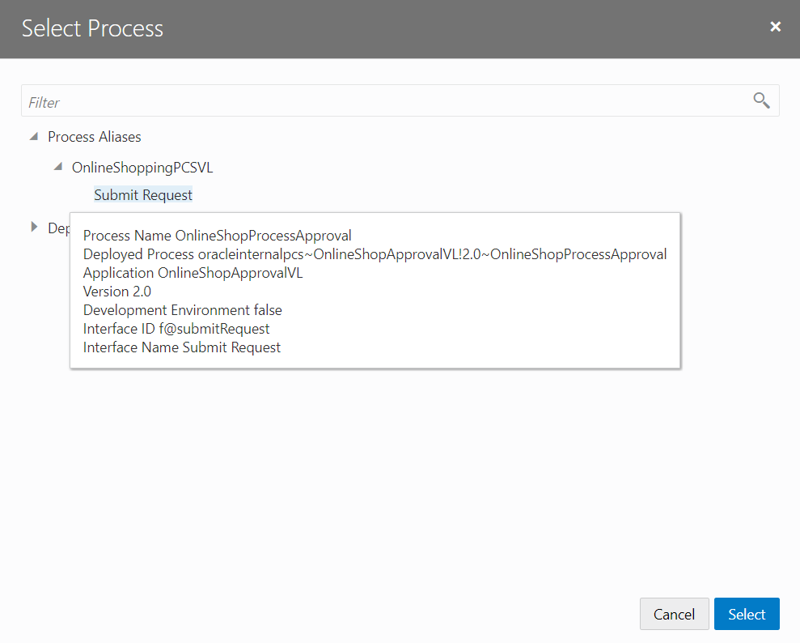

**600.4.9:** See that the interface is selected but the input parameters are not yet assigned to trigger the process interface
- Click **Assign** to assign the required input parameters

  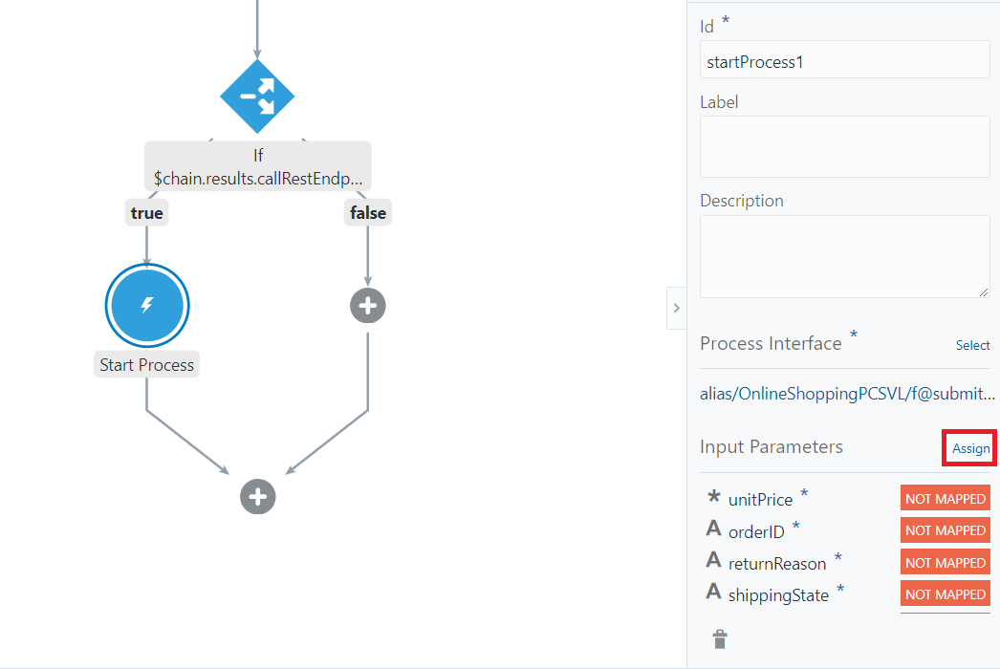

- Click on `Model` under `orderInfo` under **Page** variables on the left-hand side and drag and drop it to `model` on the right-hand side under **Parameters**

  

> ***Note here that you can also use the Page variables directly for the mapping instead of using the orderInfo variable.***

**600.4.10:**  Map the following fields

> `orderInfo/OrderId` -> `orderID`  
> `orderInfo/NumberOfItems` -> `noOfitems`  
> `orderInfo/UnitPrice` -> `unitPrice`  
> `orderInfo/ShippingState` -> `shippingState`  
> `orderInfo/ReturnReason` -> `returnReason`  
> `responseCode/response` -> `status`  
> - ***Note that the status can also be hardcoded to ORDER_SUSPENDED.***

  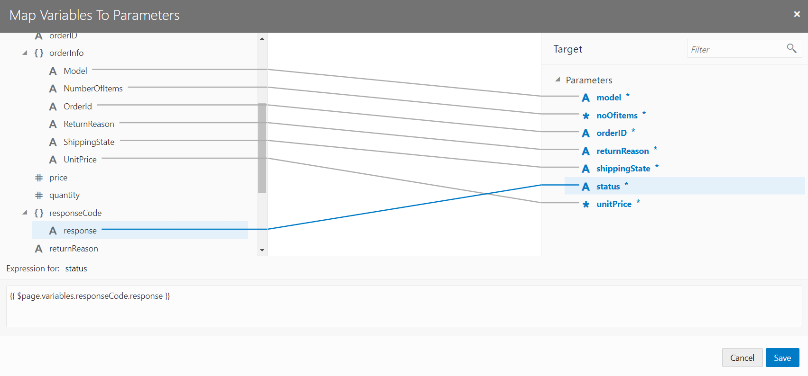

- Check that all the input parameters for the interface are now shown as mapped

  

**600.4.11:**  
- Click on the `shoppingportal` application on the left
- Switch to the **JS** view to add Javascript
- Add the following function:

  ```javascript
    AppModule.prototype.isOrderSuspended = function(orderStatus) {
      if (orderStatus === "ORDER_SUSPENDED") {
        return true;
      } else {
        return false;
        }
    };
  ```

  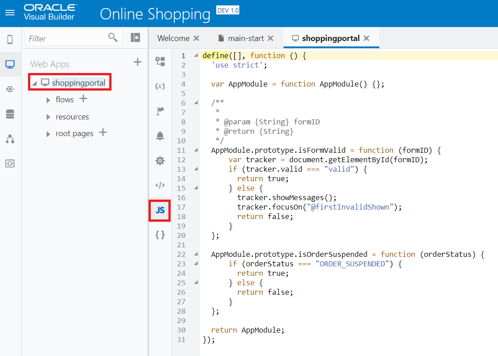

**600.4.12:**  Click on web applications icon on the left and select our form by clicking on **main-start** under `shoppingportal/flow/main`. 
> You can either work in the **Live** mode or by clicking the **Run**  icon to open a new browser window with the form
- Click on **Submit Order** with the following inputs:

  ```javascript
    Order ID      : 1N1
    Model         : Process Automation Test
    Quantity      : 2
    Price         : 300
    Ship To       : AK
    Return Reason : Process Automation Return.
  ```

  You can see the web-service (REST) call goes through and a status is returned such as `ORDER_SUSPENDED` or `ORDER_PROCESSED`. Try submitting the order until a `ORDER_SUSPENDED` is returned

  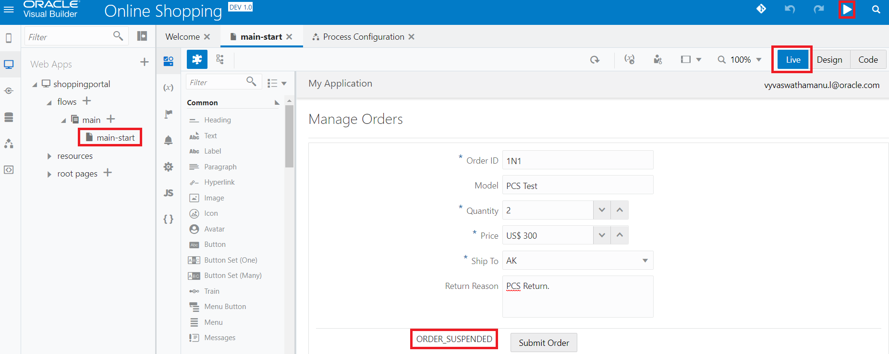

  


**600.4.13a:** At this point, the Process Automation workflow `OnlineShopProcessApproval` should have been triggerd due to a suspended order being returned from the OIC REST call with the status `ORDER_SUSPENDED`. 
- You should have received an email with a link to Process Automation to view/approve/reject the order. 
- You can click on the **View Online** link to directly open the task form
- As an alternative to the step above, you can manage the Process Automation tasks directly from VBCS

  

**600.4.13b:** Back in the **Processes** tab, click on the hamburger icon  and click on **Manage Processes** to take you to the Process Automation tasks page

  

**600.4.13c:** Click on the task to open the task form

  

**600.4.13d:** Review the form and view the workflow that was triggered for the same order that was suspended
> Check against the `Order ID` which is `1N1`

  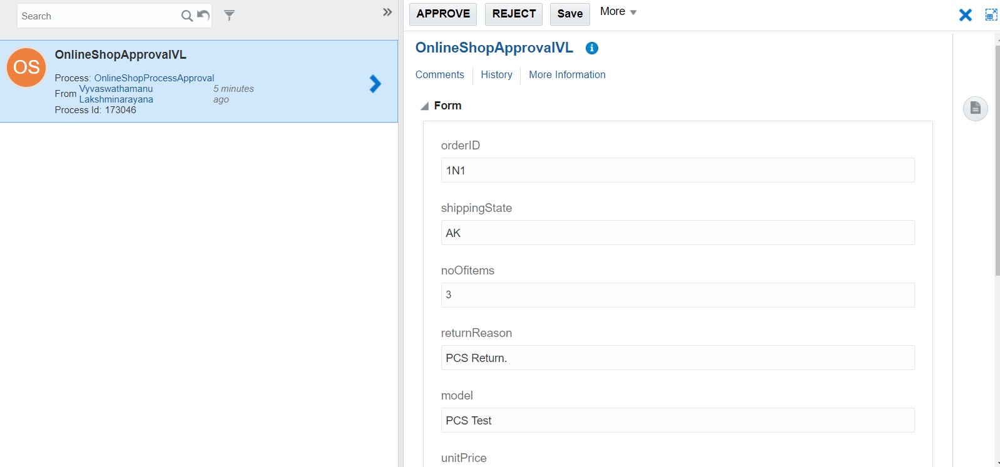

**600.4.13e:** Scroll down to see further details
- Add an optional comment and approve/reject the order after review

  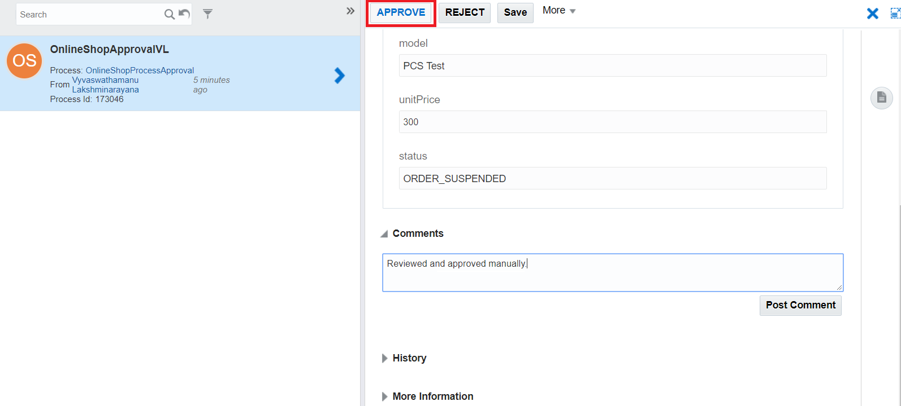

**600.4.13f:** Click **Approve** and see that the order has been approved with a green ribboned status
> Also, note that the task is also removed from the list of pending tasks
- You will receive another email saying that the task was successfully completed

  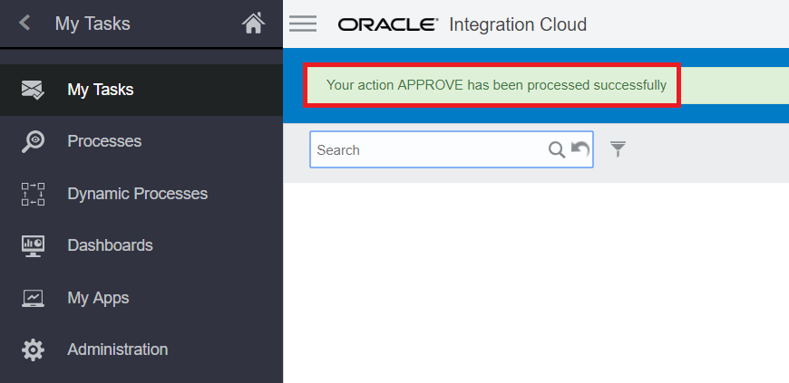

  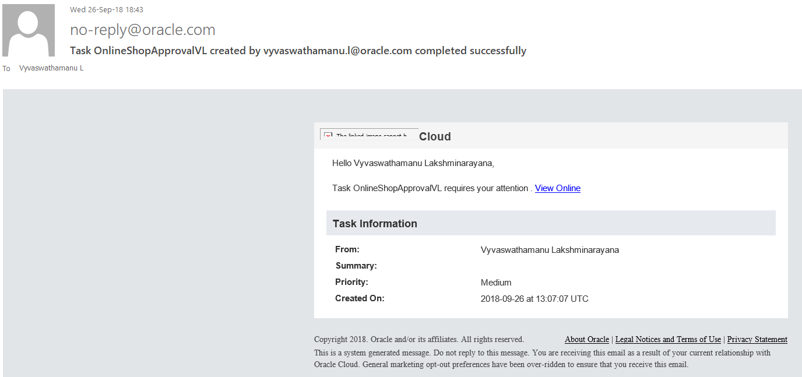

---

# **THIS LAB IS NOW COMPLETED**
> In the next lab, we are going to use API Platform Cloud Service (APIPCS) to create an API for the Online Shopping REST Endpoint and secure it using policies