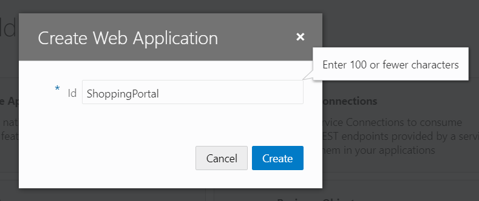
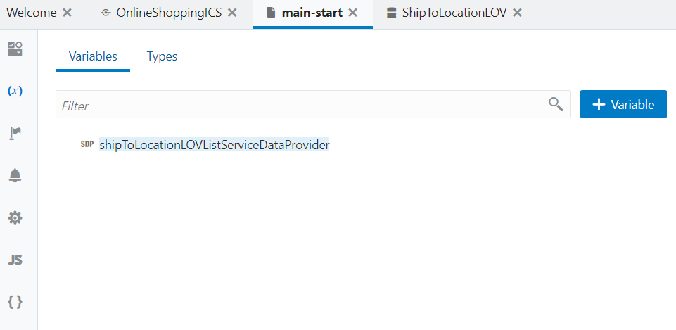
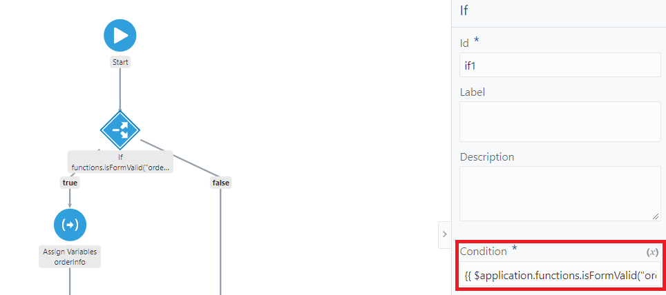

# Lab 400 - Add VBCS Web App to call ICS REST API

---

## Introduction

This is the forth of several labs that are part of the **AIC Integration Development** workshop. 

In this lab, you create a VBCS Web Application which calls the REST end-point created in the previous Lab 300.

This is how the VBCS Web Application UI would look like on the completion of this Lab -

  

Here is a description of what is happening with this web application:

A REST service (post/orders) will be called from a form-based web application. The form will submit an order and has required validations for fields (mandatory/number range/etc.). Also, a custom validation for the entire form before submitting it (using a button) will be built. The order status is returned to the web application.

## Objectives

- Learn how to create a VBCS web application
- Learn how to create form validations, business objects and modify source code
- Learn to change design views and use live mode to create/test data
- Learn how to write custom form validations

## Required Artifacts

- The following lab and an Oracle Integration Cloud account that will be supplied by your instructor
- Completion of the previous *Lab 300*

>***NOTE:*** Use Chrome or IE for the labs preferably, Firefox may cause issues in development

## Build a VBCS web application to call a REST service in ICS

### Login to AIC Integration Home Page

>***NOTE :*** The **User Name** and **Password** values will be given to you by your instructor. See _Lab 100 **1.1.1**: Login to your Oracle Cloud Account_ for more information on how to sign into the AIC Integration home page

------

You will now be presented with the AIC Service Console from which you will be performing the rest of this workshop lab.

### Login to VBCS instance

- Click on the Visual Builder link on the left

  

- The Visual Builder console should appear as below

  

### Create a VBCS application

- Click **New** to create a new Visual Application

  

- Enter `Online Shopping` followed by your initials to uniquely identify the application name. For example - `Online Shopping VL` where `VL` is the suffix and are the first letters of my first and last name. Click **Finish**

  
  
- The application dashboard opens and looks like this

  

  Check out the various options that can be done using Visual Builder Cloud, viz, **Mobile Apps, Web Apps, Service Connections, etc.**

### Create a Service Connection

- Let us create a service connection (REST) to our service built in Lab 300 as the first step. Click on **Service Connections** and click the **+ Service Connection** button on the left

  

- Select **Define by Endpoint** option on the following page

  

- Select the **Method** as **POST**, enter the REST endpoint **URL** created in the previous Lab 300 and click **Next**

  

- Enter the **Service Name** as `Online Shopping IC` in the **Service** tab

  

- Click on the **Authentication Tab**, select **Basic** and enter your ICS **Username** and **Password**

  

- On the **Request** tab, select the **Media Type** as **application/json** and enter a sample request payload **Body** -

  ```javascript
    { "OrderId":"1234", "UnitPrice":"10000", "NumberOfItems":"3", "ShippingState":"OH", "Model":"WalkeyTalkey 1.0", "ReturnReason":"Does Not Work" }
  ```

  

- Repeat the above step for **Response** tab and enter the following payload under **Body** -
  ```javascript
    {"response":"ORDER_SUCCESSFUL"}
  ```

  

- Let us test the service connection and see if the REST service returns a response. On the **Test** tab, click the **Send** button

  

- Scroll down and verify that the REST call is successful. A HTTP **200 OK** status is sent back along with a response payload

  
  
- Click on **Create** button and the screen should look like this -

  

### Create a Web Application

- Back on the **Welcome** page, Click on **Web Apps** and then click on **+ Web Application** on the left

  

- Enter the application Id as `ShoppingPortal` followed by your initials to uniquely identify the web application. For example - `ShoppingPortalVL` where `VL` is the suffix and are the first letters of my first and last name

  

- The screen should look like this -

  

  This is a right time to check out the various designs views, tools, components, etc. available in the application console

- You can swtich between design views as shown below. Choose the right view that fits your style of coding/design

  

- Let us create a web form now to hold the fields required to create/process an order by dragging and dropping components from the component palette on the left

- Drag and drop a **Heading** component which is the first of the components under **Common** elements. You can also filter components to find a component quickly

  

- Click on the property tab, you will find this towards the upper right of the screen -

  

- Name the **Text** property as `Manage Orders` and make the heading **Level** as **H2**

  

- Drag and drop a **Horizontal Rule** under the heading

  

- Repeat the step above for adding a **Panel** on to the page

  

- Again, drag and drop a **From Layout** inside the **Panel** to create our form components

  

- Edit the form properties and set **Max Columns** to **1** and **Label Edge** to **Start**

  

- Drag and drop an **Input Text** component inside the **Form Layout**

  

- Set the properties of the **Input Text** by naming **Label Hint** as `Order ID` and checking the **Required** checkbox. Selecting **Required** will make the form field mandatory marked by an asterix (**_*_**)

  

- Drag and drop a **Number** component below Order ID. Note the drop position, which is below the **Input Text** and inside the **Form Layout**. The editor highlights the drop position in blue

  

- Edit the properties as below -
  
  **Label Hint** - `Quantity (1 - 10)`
  
  **Min** - `1`
  
  **Max** - `10`

  **Required** - `Checked`

  

  Note here that we have set the **Min** and **Max** properties, and this will be validated at runtime

- Drag and drop a **Currency** component below Quantity (1-10)

  

- Set the properties as below - 

  **Label Hint** - `Price`

  **Min** - `0`

  **Max** - `1000`

  **Step** - `100`

  **Required** - `Checked`

  

  ***Scroll down here***

  **Converter** - `$`

  **Currency Code** - `USD`

  **Currecy Display** - `Symbol`

  **Currency Format** - `Standard`

  **Minimum Integer Digits** - `1`

  **Minimum Fraction Digits** - `0`

  **Maximum Fraction Digits** - `2`

  **Thousands Separator** - `Checked`

  

- Drag and drop a **Select One** below price, set **Label Hint** to `Ship To` and check the **Required** checkbox

  
 
- Now let us drag and drop another **Input Text** in between Order ID and Quantity

  

- Set the **Label Hint** to `Model` and **Placeholder** to `Ex: walkie Talkie 1.0`

  

- Drag and drop a **Text Area** below Ship To

  

- Set the **Label Hint** to `Return Reason`, **Placeholder** as `Reason if this order is a return.` and set **Rows** to `3`

  

- Now is a good time to see how our form looks in real-time. Click on **Run** icon on the top right corner

  

- The UI form should look similar to this - 

  

### Create a business object

Let us now create a business object to hold the Ship To locations and later on bind it to the **Select One** component created in the previous section

- Click on the business objects icon on the left-most icon pane and click **+ Business Object**

  

- Enter the **Label** as `ShipToLocationLOV` and click the tick-mark to create a business object

  

- Check the various tabs available in the created business object

  

- On the **Fields** tab, see that a few default fields have already been created along with the business object. Let us add a new field to hold the states for Ship To location, click on **+ New Field**. Set the **Label** as `State` and type as **String** with the **`A`** icon. Click the tick-mark to create a new field

  

- Let us add a few rows to the business object inside the **Data** tab. Click on **+ Add Row**

  

- Enter the **State** as `AK` and click the tick-mark

  

- See that the row is created and the ID is auto-populated

  

- Let us explore another method to upload data through a CSV file. Create a `states.csv` file (if you have not received the same from your instructor). The contents should be as below -

  ```javascript
    State
    CO
    DE
    FL
    GA
    HI
    IL
    KS
    LA
    MO
  ```

- Click on the import icon , upload the `states.csv` file just created, select the **Append** option and click on **Import**.

  

- Check the status and make sure the status shows green ticks. Click **OK**

  

- Verify that all the rows from the csv are updated and the existing row created (with ID 1) is not overwritten

  

### Bind data-bound components to Business Objects and create variables to hold form fields

- Back in our UI design view, select the Ship To **Single Select**. Open the properties and click on the human icon towards the right corner

  

- Click on **Add Options**. Expand and select the **GET** endpoint of the **Business Object** (ShipToLocationLOV) just created. Click **Next**

  

- Check **state** on the left hand side under `response/items/item[i]` and select **state** for both **Value** and **Label** on the right hand side. Click **Next**

  

- Leave defaults since there are no query parameters for this object and click **Finish**

  

- Check that the **Options** property under **Data** tab in the properties of the **Single Select** is updated as `[[$page.variables.shipToLocationLOVListServiceDataProvider]]` to point to ShipToLocationLOV

  

- Let us now use a new feature called the **Live** mode and test if the data is really being populated from ShipToLocationLOV. Click on **Live** and see that the Ship To shows the options from the business object ShipToLocationLOV

  

- It is good time to experiment with the source code now. Click on **Live** again to exit the **Live** mode. Click on **Code** to see the source that is being generated while we are designing the UI using a visual drag and drop approach

  

- Drag and drop a **Horizontal Rule** after the **Form Layout** under the **Panel**

  

- Drag and drop a **Button** after the **Horizontal Rule** under the **Panel**. The area where the **Button** would be placed would be highlighted in a darker shade of blue. See the screenshot below -

  

- Change the **Text** property of the button to `Submit Order`

  

- Let us create the required data types and variables to hold and submit data now. Click on variables icon on the left and click the **Types** tab. Click **+ Type** and select **From Endpoint**

  

- Expand **Service Connections** and select the **POST** service from **OnlineShoppingICS**. Click **Next**

  

- Name the type as `postOrders`, select **Request** under **Endpoint Structure** and click **Finish**

  

- Click **+ Type** and select **From Endpoint** again to create another variable of response type

  

- Name it `postOrdersResponse`, select **Response** under **Endpoint Structure** and click **Finish**

  

- Verify that the two variables are created

  

- Click **Variables** tab. Let us add variables to hold the data for all the form fields. Click **+ Variable**

  

- Name the variable `orderInfo` and select the type as **postOrders**. Click **Create**

  

- Verify that the variable is created and click **+ Variable** to create another variable

  

- Name the variable `reponseCode` and select the type to be of **postOrdersResponse**. Click **Create**

  

- Click **+ Variable** to create another variable. Name the variable `orderID` and select the type to be of **String**. Check **Create Another** checkbox and click **Create**

  

- Repeat the previous step to create the following variables -

  `model`, `returnReason`, `shipTo` of type **String**

  `price`, `quantity` of type **Number**

  The screen should look like this after all the variables are created -

  
  
- Back in the design view, select **Order ID**, click **Data** tab under the property window

  

- Open expression builder icon and select **orderID** as the **Value** for the **Input Text**. Note that you may need to click the reload icon if the variables created fail to appear under the expression builder

  

- Verify that the **Value** is updated to `{{ $page.variables.orderID }}`

  

- Repeat the above step for all the form fields and verify the **Value** is as follows -

  **Model** - `{{ $page.variables.model }}`

  **Quantity** - `{{ $page.variables.quantity }}`

  **Price** - `{{ $page.variables.price }}`
  
  **Ship To** - `{{ $page.variables.shipTo }}`
  
  **Return Reason** - `{{ $page.variables.returnReason }}`

### Map fields and variables to call the REST endpoint

- Click on the **Button** and open the property inspector. Click **+ New Event** and select **Quick Start: 'click'**. This means that an **Action Chain** will be triggered when the button is clicked

  

- Let us design the **Action Chain** to submit the form on button click. Drag and drop an **Assign Variables** action onto the flow below **Start** onto the **`+`** icon

  

- In the property inspector, click on the **Assign** link to assign and map variables

  

- Click on `model` under **Page** variables on the left-hand side and drag and drop it to `Model` under `orderInfo`

  

- Map the following fields similar to the above step -

  `orderID` -> `orderInfo/OrderId`

  `quantity` -> `orderInfo/NumberOfItems`

  `price` -> `orderInfo/UnitPrice`

  `shipTo` -> `orderInfo/ShippingState`

  `returnReason` -> `orderInfo/ReturnReason`

  The sreen will look like this after the mappings -

  

- Check that the `orderInfo` variable is mapped under **Variables**. Drag and drop a **Call Rest Endpoint** unto the **`+`** icon under the assign

  

- Click on **Select Endpoint**

  

- Expand **Service Connections** and select the **POST** service from **OnlineShoppingICS**. Click **Select**

  

- See that the parameters are in the **NOT MAPPED** status. Click on the **Assign** link to assign the parameters

  

- Map the `orderInfo`on the left-hand side under **Page** variables to `body` on the right-hand side under **Parameters**

  

- Add another **Assign** to assign the return value from the REST service call. This time drop it on the **`+`** icon next to the **Call Rest Endpoint** and not below it

  

- Drag another **Assign** on the left side **`+`** icon below **Call Rest Endpoint**

  

- Now let us assign the return values from the REST call. Click on the **Assign** under `success`, and click the **Assign** link beside **Variables**

  

- Drag and drop the `response` element under **Results** on the left to `responseCode/response` on the right under **Page** variables

  

- Repeat the two steps above for the **Assign** under `failure`. This time, instead of dragging and dropping an element, paste the following snippet for the **Page** variable `responseCode` on the right -
  
  ```javascript
    {
    "response": "Failure"
    }
  ```

  

- The final **Action Chain** would look similar to this -

  

### Test the entire Web Application

We can test the application in **Live** mode or by clicking the **Run** icon on the top right corner which opens the form in a new browser window. To test the application, we need to capture the response and display it somewhere so that we know what is happening behind the scenes, whether the REST endpoint was called, whether the call was successful or the call failed. We can achieve this simply by using a **Text** component and setting the value of the component to the reponse payload from the web-service call.

- Drag and drop a **Text** component. You can use the **Filter** option to find it quickly

  

- Open up the expression builder and set the **Value** property of the **Text** component to `responseCode/response`

  

- Verify that the value is updated to `{{ $page.variables.responseCode.response }}`

  

- Either select the **Live** mode by clicking  or click the **Run**  icon to open the form in a new browser tab

- Play around the form and try entering various values, wrong values, empty values and for the various form fields. You can see that the validations we created on the form fields are at play after tabbing out or after the form field loses focus. Click on the **Submit Order** with the following input -

  ```javascript
    Order ID      : 1
    Model         : Test
    Quantity      : 1
    Price         : 1000
    Ship To       : CO
    Return Reason : (Optional - any random text)
  ```

  You can see the web-service (REST) call goes through and a status is returned such as`ORDER_SUSPENDED` or `ORDER_PROCESSED`

  

- Enter wrong values and see that the validation happens. For example -

  ```javascript
    Order ID      : (blank)
    Model         : (blank)
    Quantity      : -100
    Price         : 100000
    Ship To       : (not selected/blank)
    Return Reason : (Optional - any random text)
  ```
  You can see the web-service (REST) call goes through but no status is returned; the form validation is at play and the status of `Failure` that we set in the **Action Chain** is used and printed on the UI this time

  

  ***NOTE :*** Enter a different **Order ID** every time you click on the **Submit Order** button so that the REST endpoint returns a valid value.

Let us alter the flow in the next section so that the form is submitted only when all the form fields are validated.

### Add Client-Side Validation to the form

First we have to set up our form to check the validity of its contents before submitting. We do this by surrounding the form with an `<oj-validation-group>` element, adding a custom isFormValid Javascript function that returns a boolean, and then calling that function before submitting the form.

Now it is time to experiment directly on the source and add some code!

- Click on the **Code** button and view the source code that has been generated till now

  

- Surround the form **div** with `<oj-validation-group id="orderForm">`. Don't forget the closing tag

  

- Now the page won't load because we haven't imported the `oj-validation-group` component. Switch to the **Code** view -

  

- Add the following section in bold to the bottom of the imports section:

  
  
  ```javascript
    "oj-validation-group": {
        "path": "ojs/ojvalidationgroup"
      }
  ```

  Note the **`,`** (comma) before adding the value above

- Click on the `shoppingportal` application on the left and switch to the **JS** view to add Javascript. Add the following function -

  ```javascript
      AppModule.prototype.isFormValid = function(form) {
      var tracker = document.getElementById(form); 
      if (tracker.valid === "valid") {
        return true;
      } else {
        tracker.showMessages();
        tracker.focusOn("@firstInvalidShown");
        return false;
        }
      };
  ```

  

- Let us change the **Action Chain** on button click to call this form validation function. Click on **Actions** and click on **ButtonClickAction**

  

- Drag and drop an **If** under **Logic** to the line below **Start**

  

- Now, move the **Assign Variables orderInfo** onto the **`+`** icon under the **true** branch of the **If** as shown below -

  

- Click on the **If** and set the **Condition** property to `{{ $application.functions.isFormValid("orderForm") }}`. This will call the form validation Javascript function that we previously wrote

  

- The final **Action Chain** looks as below -

  

- Now run the form again by clicking the **Run**  icon. Click the **Submit Order** button without filling any of the form fields and see that the form does not get submitted this time and the REST endpoint is not called but the entire form is validated

  

- Fill in the form fields and click **Submit Order** and verify that the REST endpoint is called successfully and a valid status is returned

  
---

You have now completed the first VBCS Lab (400) from the AIC Developer Workshop.

Congratulations! You should now have a much better understanding of how to work with VBCS to create web applications.
